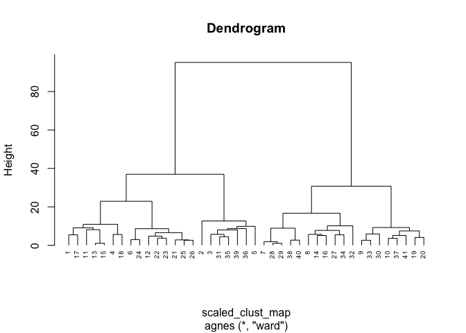

[Statology: Hierarchical Clustering in R: Step-by-Step Example](https://www.statology.org/hierarchical-clustering-in-r/)


```r
#install.packages("viridisLite")
#install.packages("svglite")
#install.packages("factoextra")
#install.packages("cluster")
#install.packages("ggdendro")
#install.packages("grid")
```

## Load the Libraries


```r
library(tidyverse)
```

```
## ── Attaching packages ─────────────────────────────────────── tidyverse 1.3.1 ──
```

```
## ✔ ggplot2 3.4.0     ✔ purrr   0.3.4
## ✔ tibble  3.1.6     ✔ dplyr   1.0.8
## ✔ tidyr   1.2.0     ✔ stringr 1.4.0
## ✔ readr   2.1.1     ✔ forcats 0.5.1
```

```
## ── Conflicts ────────────────────────────────────────── tidyverse_conflicts() ──
## ✖ dplyr::filter() masks stats::filter()
## ✖ dplyr::lag()    masks stats::lag()
```

```r
library(RColorBrewer)
library(paletteer)
library(janitor)
```

```
## 
## Attaching package: 'janitor'
```

```
## The following objects are masked from 'package:stats':
## 
##     chisq.test, fisher.test
```

```r
library(here)
```

```
## here() starts at /Users/kaylahmarcello/Desktop/BIS15L-W22-cyanobacteria-blooms
```

```r
library(skimr)
library(viridis)
```

```
## Loading required package: viridisLite
```

```r
library(shiny)
library(shinydashboard)
```

```
## 
## Attaching package: 'shinydashboard'
```

```
## The following object is masked from 'package:graphics':
## 
##     box
```

```r
library(devtools)
```

```
## Loading required package: usethis
```

```r
library(svglite)
library(cluster)
library(factoextra)
```

```
## Welcome! Want to learn more? See two factoextra-related books at https://goo.gl/ve3WBa
```

```r
library(ggdendro)
library(grid)
```


```r
filament_cyanos <- readr::read_csv("data/filamentous_cyano_meta.csv")
```

```
## New names:
## Rows: 51 Columns: 40
## ── Column specification
## ──────────────────────────────────────────────────────── Delimiter: "," chr
## (18): GenBank Assembly ID (Accession.version), RefSeq Assembly ID (Acces... dbl
## (22): Tempurature (avg), gene_gyrA, gene_nusA, gene_infC, gene_infA, gen...
## ℹ Use `spec()` to retrieve the full column specification for this data. ℹ
## Specify the column types or set `show_col_types = FALSE` to quiet this message.
## • `Storage/Collection` -> `Storage/Collection...10`
## • `Storage/Collection` -> `Storage/Collection...17`
```


```r
summary(filament_cyanos)
```

```
##  GenBank Assembly ID (Accession.version) RefSeq Assembly ID (Accession.version)
##  Length:51                               Length:51                             
##  Class :character                        Class :character                      
##  Mode  :character                        Mode  :character                      
##                                                                                
##                                                                                
##                                                                                
##                                                                                
##  Accession #          Organism            Genus             Species         
##  Length:51          Length:51          Length:51          Length:51         
##  Class :character   Class :character   Class :character   Class :character  
##  Mode  :character   Mode  :character   Mode  :character   Mode  :character  
##                                                                             
##                                                                             
##                                                                             
##                                                                             
##     Strain          fila_single        environment       
##  Length:51          Length:51          Length:51         
##  Class :character   Class :character   Class :character  
##  Mode  :character   Mode  :character   Mode  :character  
##                                                          
##                                                          
##                                                          
##                                                          
##  Storage/Collection...10 Regional Loaction  geographic feature
##  Length:51               Length:51          Length:51         
##  Class :character        Class :character   Class :character  
##  Mode  :character        Mode  :character   Mode  :character  
##                                                               
##                                                               
##                                                               
##                                                               
##  Environment Detail Tempurature (avg)   Lat/Long         Collection date   
##  Length:51          Min.   :-2.00     Length:51          Length:51         
##  Class :character   1st Qu.: 5.60     Class :character   Class :character  
##  Mode  :character   Median :15.00     Mode  :character   Mode  :character  
##                     Mean   :16.44                                          
##                     3rd Qu.:25.00                                          
##                     Max.   :56.00                                          
##                     NA's   :24                                             
##  Storage/Collection...17 genome_or_bin        gene_gyrA       gene_nusA    
##  Length:51               Length:51          Min.   :2.000   Min.   :1.000  
##  Class :character        Class :character   1st Qu.:2.000   1st Qu.:1.000  
##  Mode  :character        Mode  :character   Median :2.000   Median :1.000  
##                                             Mean   :2.024   Mean   :1.024  
##                                             3rd Qu.:2.000   3rd Qu.:1.000  
##                                             Max.   :3.000   Max.   :2.000  
##                                             NA's   :10      NA's   :10     
##    gene_infC       gene_infA        gene_otsA        gene_dnaK     
##  Min.   :1.000   Min.   :0.0000   Min.   :0.0000   Min.   : 5.000  
##  1st Qu.:1.000   1st Qu.:1.0000   1st Qu.:0.0000   1st Qu.: 7.000  
##  Median :1.000   Median :1.0000   Median :0.0000   Median : 7.000  
##  Mean   :1.585   Mean   :0.9756   Mean   :0.1707   Mean   : 7.561  
##  3rd Qu.:2.000   3rd Qu.:1.0000   3rd Qu.:0.0000   3rd Qu.: 8.000  
##  Max.   :5.000   Max.   :2.0000   Max.   :1.0000   Max.   :11.000  
##  NA's   :10      NA's   :10       NA's   :10       NA's   :10      
##    gene_recA       gene_dnaJ        gene_aceF       gene_deaD    
##  Min.   :1.000   Min.   : 5.000   Min.   :1.000   Min.   : 8.00  
##  1st Qu.:1.000   1st Qu.: 7.000   1st Qu.:1.000   1st Qu.:12.00  
##  Median :1.000   Median : 9.000   Median :1.000   Median :14.00  
##  Mean   :1.195   Mean   : 8.659   Mean   :1.171   Mean   :14.83  
##  3rd Qu.:1.000   3rd Qu.:10.000   3rd Qu.:1.000   3rd Qu.:16.00  
##  Max.   :3.000   Max.   :12.000   Max.   :3.000   Max.   :24.00  
##  NA's   :10      NA's   :10       NA's   :10      NA's   :10     
##    gene_infB        gene_tig     gene_rnr       gene_dnaA        gene_hupB    
##  Min.   :5.000   Min.   :1    Min.   :2.000   Min.   : 1.000   Min.   :1.000  
##  1st Qu.:5.000   1st Qu.:1    1st Qu.:2.000   1st Qu.: 1.000   1st Qu.:1.000  
##  Median :5.000   Median :1    Median :2.000   Median : 2.000   Median :2.000  
##  Mean   :5.317   Mean   :1    Mean   :2.098   Mean   : 2.073   Mean   :2.122  
##  3rd Qu.:6.000   3rd Qu.:1    3rd Qu.:2.000   3rd Qu.: 2.000   3rd Qu.:3.000  
##  Max.   :7.000   Max.   :1    Max.   :4.000   Max.   :11.000   Max.   :5.000  
##  NA's   :10      NA's   :10   NA's   :10      NA's   :10       NA's   :10     
##    gene_rbfA       gene_yflA          gene_pnp        gene_csp     
##  Min.   :1.000   Min.   :0.00000   Min.   :3.000   Min.   :0.0000  
##  1st Qu.:1.000   1st Qu.:0.00000   1st Qu.:4.000   1st Qu.:0.0000  
##  Median :1.000   Median :0.00000   Median :4.000   Median :0.0000  
##  Mean   :1.098   Mean   :0.07317   Mean   :4.098   Mean   :0.5122  
##  3rd Qu.:1.000   3rd Qu.:0.00000   3rd Qu.:4.000   3rd Qu.:1.0000  
##  Max.   :2.000   Max.   :2.00000   Max.   :6.000   Max.   :2.0000  
##  NA's   :10      NA's   :10        NA's   :10      NA's   :10      
##    gene_aceE      gene_desA      temp source       
##  Min.   :0.00   Min.   : 3.000   Length:51         
##  1st Qu.:1.00   1st Qu.: 5.000   Class :character  
##  Median :1.00   Median : 7.000   Mode  :character  
##  Mean   :1.22   Mean   : 6.805                     
##  3rd Qu.:1.00   3rd Qu.: 8.000                     
##  Max.   :2.00   Max.   :11.000                     
##  NA's   :10     NA's   :10
```


```r
filament_cyanos <- clean_names(filament_cyanos)
```


```r
names(filament_cyanos)
```

```
##  [1] "gen_bank_assembly_id_accession_version"
##  [2] "ref_seq_assembly_id_accession_version" 
##  [3] "accession_number"                      
##  [4] "organism"                              
##  [5] "genus"                                 
##  [6] "species"                               
##  [7] "strain"                                
##  [8] "fila_single"                           
##  [9] "environment"                           
## [10] "storage_collection_10"                 
## [11] "regional_loaction"                     
## [12] "geographic_feature"                    
## [13] "environment_detail"                    
## [14] "tempurature_avg"                       
## [15] "lat_long"                              
## [16] "collection_date"                       
## [17] "storage_collection_17"                 
## [18] "genome_or_bin"                         
## [19] "gene_gyr_a"                            
## [20] "gene_nus_a"                            
## [21] "gene_inf_c"                            
## [22] "gene_inf_a"                            
## [23] "gene_ots_a"                            
## [24] "gene_dna_k"                            
## [25] "gene_rec_a"                            
## [26] "gene_dna_j"                            
## [27] "gene_ace_f"                            
## [28] "gene_dea_d"                            
## [29] "gene_inf_b"                            
## [30] "gene_tig"                              
## [31] "gene_rnr"                              
## [32] "gene_dna_a"                            
## [33] "gene_hup_b"                            
## [34] "gene_rbf_a"                            
## [35] "gene_yfl_a"                            
## [36] "gene_pnp"                              
## [37] "gene_csp"                              
## [38] "gene_ace_e"                            
## [39] "gene_des_a"                            
## [40] "temp_source"
```


```r
head(filament_cyanos)
```

```
## # A tibble: 6 × 40
##   gen_bank_assembly_id… ref_seq_assembl… accession_number organism genus species
##   <chr>                 <chr>            <chr>            <chr>    <chr> <chr>  
## 1 GCA_000020025.1       GCF_000020025.1  ASM2002v1        Nostoc … Nost… puncti…
## 2 GCA_000317105.1       GCF_000317105.1  ASM31710v1       Oscilla… Osci… acumin…
## 3 GCA_000317475.1       GCF_000317475.1  ASM31747v1       Oscilla… Osci… nigro-…
## 4 GCA_012516315.1       GCF_012516315.1  ASM1251631v1     Limnosp… Limn… fusifo…
## 5 GCA_002813575.1       GCF_002813575.1  ASM281357v1      Nostoc … Nost… flagel…
## 6 GCA_000014265.1       GCF_000014265.1  ASM1426v1        Trichod… Tric… erythr…
## # … with 34 more variables: strain <chr>, fila_single <chr>, environment <chr>,
## #   storage_collection_10 <chr>, regional_loaction <chr>,
## #   geographic_feature <chr>, environment_detail <chr>, tempurature_avg <dbl>,
## #   lat_long <chr>, collection_date <chr>, storage_collection_17 <chr>,
## #   genome_or_bin <chr>, gene_gyr_a <dbl>, gene_nus_a <dbl>, gene_inf_c <dbl>,
## #   gene_inf_a <dbl>, gene_ots_a <dbl>, gene_dna_k <dbl>, gene_rec_a <dbl>,
## #   gene_dna_j <dbl>, gene_ace_f <dbl>, gene_dea_d <dbl>, gene_inf_b <dbl>, …
```


```r
gene_data_organism <- filament_cyanos %>% 
  select(organism, contains("gene_")) %>% # get rid of the gene_ part for the final pres.
  pivot_longer(-organism,
               names_to = "gene",
               values_to = "gene_count") %>% 
  filter(!is.na(gene_count))
gene_data_organism
```

```
## # A tibble: 861 × 3
##    organism                     gene       gene_count
##    <chr>                        <chr>           <dbl>
##  1 Nostoc punctiforme PCC 73102 gene_gyr_a          2
##  2 Nostoc punctiforme PCC 73102 gene_nus_a          1
##  3 Nostoc punctiforme PCC 73102 gene_inf_c          5
##  4 Nostoc punctiforme PCC 73102 gene_inf_a          1
##  5 Nostoc punctiforme PCC 73102 gene_ots_a          0
##  6 Nostoc punctiforme PCC 73102 gene_dna_k         10
##  7 Nostoc punctiforme PCC 73102 gene_rec_a          1
##  8 Nostoc punctiforme PCC 73102 gene_dna_j         12
##  9 Nostoc punctiforme PCC 73102 gene_ace_f          3
## 10 Nostoc punctiforme PCC 73102 gene_dea_d         19
## # … with 851 more rows
```

## combining heatmap and dendrogram

```r
gene_data_organism$gene_count <- as.numeric(gene_data_organism$gene_count) # needs to be numeric for scale()
lapply(gene_data_organism, class)
```

```
## $organism
## [1] "character"
## 
## $gene
## [1] "character"
## 
## $gene_count
## [1] "numeric"
```


```r
clust_map_org <- gene_data_organism %>% # make pivot_wider for scale()
  pivot_wider(names_from = "gene",
              values_from = "gene_count")
clust_map_org
```

```
## # A tibble: 41 × 22
##    organism    gene_gyr_a gene_nus_a gene_inf_c gene_inf_a gene_ots_a gene_dna_k
##    <chr>            <dbl>      <dbl>      <dbl>      <dbl>      <dbl>      <dbl>
##  1 Nostoc pun…          2          1          5          1          0         10
##  2 Oscillator…          2          2          1          1          0          9
##  3 Oscillator…          2          1          1          1          0          7
##  4 Nostoc fla…          2          1          2          0          1          7
##  5 Trichodesm…          2          1          1          1          0         11
##  6 Nostoc sph…          2          1          2          1          0          9
##  7 Leptolyngb…          2          1          1          1          0          5
##  8 Nostoc azo…          2          1          1          1          0          8
##  9 Dolichospe…          2          1          1          1          0          7
## 10 Anabaena c…          2          1          1          1          0          8
## # … with 31 more rows, and 15 more variables: gene_rec_a <dbl>,
## #   gene_dna_j <dbl>, gene_ace_f <dbl>, gene_dea_d <dbl>, gene_inf_b <dbl>,
## #   gene_tig <dbl>, gene_rnr <dbl>, gene_dna_a <dbl>, gene_hup_b <dbl>,
## #   gene_rbf_a <dbl>, gene_yfl_a <dbl>, gene_pnp <dbl>, gene_csp <dbl>,
## #   gene_ace_e <dbl>, gene_des_a <dbl>
```


```r
scaled_clust_map <- clust_map_org 
scaled_clust_map[, c(2:22)] <- scale(scaled_clust_map[, 2:22])
scaled_clust_map
```

```
## # A tibble: 41 × 22
##    organism    gene_gyr_a gene_nus_a gene_inf_c gene_inf_a gene_ots_a gene_dna_k
##    <chr>            <dbl>      <dbl>      <dbl>      <dbl>      <dbl>      <dbl>
##  1 Nostoc pun…     -0.156     -0.156      4.24      0.0894     -0.448      1.70 
##  2 Oscillator…     -0.156      6.25      -0.727     0.0894     -0.448      1.00 
##  3 Oscillator…     -0.156     -0.156     -0.727     0.0894     -0.448     -0.392
##  4 Nostoc fla…     -0.156     -0.156      0.515    -3.58        2.18      -0.392
##  5 Trichodesm…     -0.156     -0.156     -0.727     0.0894     -0.448      2.40 
##  6 Nostoc sph…     -0.156     -0.156      0.515     0.0894     -0.448      1.00 
##  7 Leptolyngb…     -0.156     -0.156     -0.727     0.0894     -0.448     -1.79 
##  8 Nostoc azo…     -0.156     -0.156     -0.727     0.0894     -0.448      0.306
##  9 Dolichospe…     -0.156     -0.156     -0.727     0.0894     -0.448     -0.392
## 10 Anabaena c…     -0.156     -0.156     -0.727     0.0894     -0.448      0.306
## # … with 31 more rows, and 15 more variables: gene_rec_a <dbl>,
## #   gene_dna_j <dbl>, gene_ace_f <dbl>, gene_dea_d <dbl>, gene_inf_b <dbl>,
## #   gene_tig <dbl>, gene_rnr <dbl>, gene_dna_a <dbl>, gene_hup_b <dbl>,
## #   gene_rbf_a <dbl>, gene_yfl_a <dbl>, gene_pnp <dbl>, gene_csp <dbl>,
## #   gene_ace_e <dbl>, gene_des_a <dbl>
```


```r
m <- c("average", "single", "complete", "ward")
names(m) <- c( "average", "single", "complete", "ward")
```


```r
ac <- function(x) {
  agnes(scaled_clust_map, method = x)$ac
}
```


```r
sapply(m, ac)
```

```
##   average    single  complete      ward 
## 0.7973731 0.5279191 0.8896321 0.9513309
```
"gene_gyr_a", "gene_nus_a", "gene_inf_c", "gene_inf_a", "gene_ots_a", "gene_dna_k", "gene_rec_a", "gene_dna_j", "gene_ace_f", "gene_dea_d", "gene_inf_b", "gene_tig", "gene_rnr", "gene_dna_a", "gene_hup_b", "gene_rbf_a", "gene_yfl_a", "gene_pnp", "gene_csp", "gene_ace_e", "gene_des_a"


```r
clust <- agnes(scaled_clust_map, method = "ward")
```


```r
pltree(clust, cex = 0.6, hang = -1, main = "Dendrogram")
```

<!-- -->


```r
#gap_stat <- clusGap(scaled_clust_map, FUN = hcut, nstart = 25, K.max = 10, B = 50)
#fviz_gap_stat(gap_stat)
```

