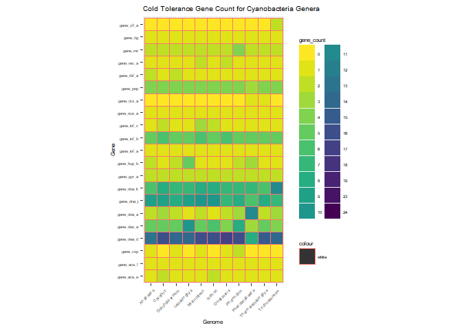
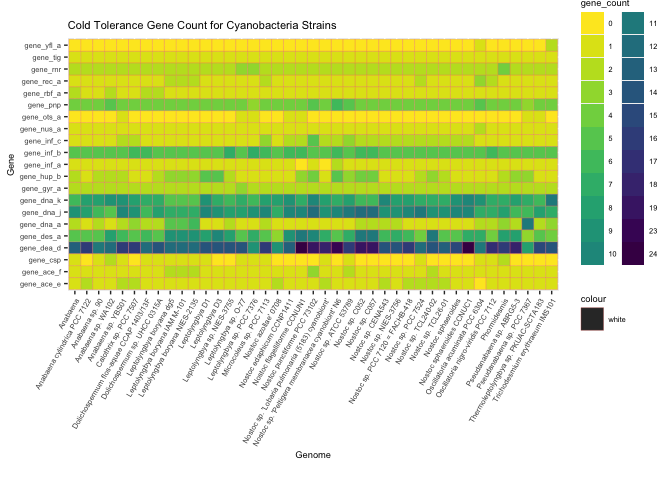
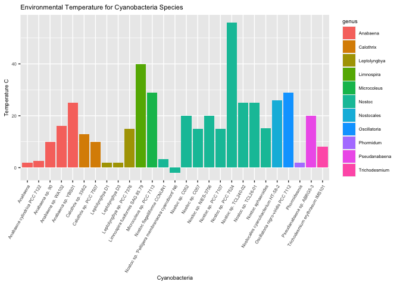
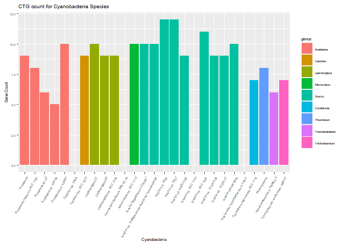

```r
#install.packages("viridisLite")
#install.packages("svglite")
```


## Load the Libraries


```r
library(tidyverse)
```

```
## ── Attaching packages ─────────────────────────────────────── tidyverse 1.3.1 ──
```

```
## ✓ ggplot2 3.3.5     ✓ purrr   0.3.4
## ✓ tibble  3.1.6     ✓ dplyr   1.0.8
## ✓ tidyr   1.2.0     ✓ stringr 1.4.0
## ✓ readr   2.1.1     ✓ forcats 0.5.1
```

```
## ── Conflicts ────────────────────────────────────────── tidyverse_conflicts() ──
## x dplyr::filter() masks stats::filter()
## x dplyr::lag()    masks stats::lag()
```

```r
library(RColorBrewer)
library(paletteer)
library(janitor)
```

```
## 
## Attaching package: 'janitor'
```

```
## The following objects are masked from 'package:stats':
## 
##     chisq.test, fisher.test
```

```r
library(here)
```

```
## here() starts at /Users/kaylahmarcello/Desktop/BIS15L-W22-cyanobacteria-blooms
```

```r
library(skimr)
library(viridis)
```

```
## Loading required package: viridisLite
```

```r
library(shiny)
library(shinydashboard)
```

```
## 
## Attaching package: 'shinydashboard'
```

```
## The following object is masked from 'package:graphics':
## 
##     box
```

```r
library(devtools)
```

```
## Loading required package: usethis
```

```r
library(svglite)
```


```r
filament_cyanos <- readr::read_csv("data/filamentous_cyano_meta.csv")
```

```
## New names:
## * `Storage/Collection` -> `Storage/Collection...10`
## * `Storage/Collection` -> `Storage/Collection...17`
```

```
## Rows: 51 Columns: 40
## ── Column specification ────────────────────────────────────────────────────────
## Delimiter: ","
## chr (18): GenBank Assembly ID (Accession.version), RefSeq Assembly ID (Acces...
## dbl (22): Tempurature (avg), gene_gyrA, gene_nusA, gene_infC, gene_infA, gen...
## 
## ℹ Use `spec()` to retrieve the full column specification for this data.
## ℹ Specify the column types or set `show_col_types = FALSE` to quiet this message.
```
## Get an Idea of the Structure

```r
summary(filament_cyanos)
```

```
##  GenBank Assembly ID (Accession.version) RefSeq Assembly ID (Accession.version)
##  Length:51                               Length:51                             
##  Class :character                        Class :character                      
##  Mode  :character                        Mode  :character                      
##                                                                                
##                                                                                
##                                                                                
##                                                                                
##  Accession #          Organism            Genus             Species         
##  Length:51          Length:51          Length:51          Length:51         
##  Class :character   Class :character   Class :character   Class :character  
##  Mode  :character   Mode  :character   Mode  :character   Mode  :character  
##                                                                             
##                                                                             
##                                                                             
##                                                                             
##     Strain          fila_single        environment       
##  Length:51          Length:51          Length:51         
##  Class :character   Class :character   Class :character  
##  Mode  :character   Mode  :character   Mode  :character  
##                                                          
##                                                          
##                                                          
##                                                          
##  Storage/Collection...10 Regional Loaction  geographic feature
##  Length:51               Length:51          Length:51         
##  Class :character        Class :character   Class :character  
##  Mode  :character        Mode  :character   Mode  :character  
##                                                               
##                                                               
##                                                               
##                                                               
##  Environment Detail Tempurature (avg)   Lat/Long         Collection date   
##  Length:51          Min.   :-2.00     Length:51          Length:51         
##  Class :character   1st Qu.: 5.60     Class :character   Class :character  
##  Mode  :character   Median :15.00     Mode  :character   Mode  :character  
##                     Mean   :16.44                                          
##                     3rd Qu.:25.00                                          
##                     Max.   :56.00                                          
##                     NA's   :24                                             
##  Storage/Collection...17 genome_or_bin        gene_gyrA       gene_nusA    
##  Length:51               Length:51          Min.   :2.000   Min.   :1.000  
##  Class :character        Class :character   1st Qu.:2.000   1st Qu.:1.000  
##  Mode  :character        Mode  :character   Median :2.000   Median :1.000  
##                                             Mean   :2.024   Mean   :1.024  
##                                             3rd Qu.:2.000   3rd Qu.:1.000  
##                                             Max.   :3.000   Max.   :2.000  
##                                             NA's   :10      NA's   :10     
##    gene_infC       gene_infA        gene_otsA        gene_dnaK     
##  Min.   :1.000   Min.   :0.0000   Min.   :0.0000   Min.   : 5.000  
##  1st Qu.:1.000   1st Qu.:1.0000   1st Qu.:0.0000   1st Qu.: 7.000  
##  Median :1.000   Median :1.0000   Median :0.0000   Median : 7.000  
##  Mean   :1.585   Mean   :0.9756   Mean   :0.1707   Mean   : 7.561  
##  3rd Qu.:2.000   3rd Qu.:1.0000   3rd Qu.:0.0000   3rd Qu.: 8.000  
##  Max.   :5.000   Max.   :2.0000   Max.   :1.0000   Max.   :11.000  
##  NA's   :10      NA's   :10       NA's   :10       NA's   :10      
##    gene_recA       gene_dnaJ        gene_aceF       gene_deaD    
##  Min.   :1.000   Min.   : 5.000   Min.   :1.000   Min.   : 8.00  
##  1st Qu.:1.000   1st Qu.: 7.000   1st Qu.:1.000   1st Qu.:12.00  
##  Median :1.000   Median : 9.000   Median :1.000   Median :14.00  
##  Mean   :1.195   Mean   : 8.659   Mean   :1.171   Mean   :14.83  
##  3rd Qu.:1.000   3rd Qu.:10.000   3rd Qu.:1.000   3rd Qu.:16.00  
##  Max.   :3.000   Max.   :12.000   Max.   :3.000   Max.   :24.00  
##  NA's   :10      NA's   :10       NA's   :10      NA's   :10     
##    gene_infB        gene_tig     gene_rnr       gene_dnaA        gene_hupB    
##  Min.   :5.000   Min.   :1    Min.   :2.000   Min.   : 1.000   Min.   :1.000  
##  1st Qu.:5.000   1st Qu.:1    1st Qu.:2.000   1st Qu.: 1.000   1st Qu.:1.000  
##  Median :5.000   Median :1    Median :2.000   Median : 2.000   Median :2.000  
##  Mean   :5.317   Mean   :1    Mean   :2.098   Mean   : 2.073   Mean   :2.122  
##  3rd Qu.:6.000   3rd Qu.:1    3rd Qu.:2.000   3rd Qu.: 2.000   3rd Qu.:3.000  
##  Max.   :7.000   Max.   :1    Max.   :4.000   Max.   :11.000   Max.   :5.000  
##  NA's   :10      NA's   :10   NA's   :10      NA's   :10       NA's   :10     
##    gene_rbfA       gene_yflA          gene_pnp        gene_csp     
##  Min.   :1.000   Min.   :0.00000   Min.   :3.000   Min.   :0.0000  
##  1st Qu.:1.000   1st Qu.:0.00000   1st Qu.:4.000   1st Qu.:0.0000  
##  Median :1.000   Median :0.00000   Median :4.000   Median :0.0000  
##  Mean   :1.098   Mean   :0.07317   Mean   :4.098   Mean   :0.5122  
##  3rd Qu.:1.000   3rd Qu.:0.00000   3rd Qu.:4.000   3rd Qu.:1.0000  
##  Max.   :2.000   Max.   :2.00000   Max.   :6.000   Max.   :2.0000  
##  NA's   :10      NA's   :10        NA's   :10      NA's   :10      
##    gene_aceE      gene_desA      temp source       
##  Min.   :0.00   Min.   : 3.000   Length:51         
##  1st Qu.:1.00   1st Qu.: 5.000   Class :character  
##  Median :1.00   Median : 7.000   Mode  :character  
##  Mean   :1.22   Mean   : 6.805                     
##  3rd Qu.:1.00   3rd Qu.: 8.000                     
##  Max.   :2.00   Max.   :11.000                     
##  NA's   :10     NA's   :10
```


```r
head(filament_cyanos)
```

```
## # A tibble: 6 × 40
##   `GenBank Assemb…` `RefSeq Assemb…` `Accession #` Organism Genus Species Strain
##   <chr>             <chr>            <chr>         <chr>    <chr> <chr>   <chr> 
## 1 GCA_000020025.1   GCF_000020025.1  ASM2002v1     Nostoc … Nost… puncti… PCC 7…
## 2 GCA_000317105.1   GCF_000317105.1  ASM31710v1    Oscilla… Osci… acumin… PCC 6…
## 3 GCA_000317475.1   GCF_000317475.1  ASM31747v1    Oscilla… Osci… nigro-… <NA>  
## 4 GCA_012516315.1   GCF_012516315.1  ASM1251631v1  Limnosp… Limn… fusifo… SAG 8…
## 5 GCA_002813575.1   GCF_002813575.1  ASM281357v1   Nostoc … Nost… flagel… CCNUN1
## 6 GCA_000014265.1   GCF_000014265.1  ASM1426v1     Trichod… Tric… erythr… IMS101
## # … with 33 more variables: fila_single <chr>, environment <chr>,
## #   `Storage/Collection...10` <chr>, `Regional Loaction` <chr>,
## #   `geographic feature` <chr>, `Environment Detail` <chr>,
## #   `Tempurature (avg)` <dbl>, `Lat/Long` <chr>, `Collection date` <chr>,
## #   `Storage/Collection...17` <chr>, genome_or_bin <chr>, gene_gyrA <dbl>,
## #   gene_nusA <dbl>, gene_infC <dbl>, gene_infA <dbl>, gene_otsA <dbl>,
## #   gene_dnaK <dbl>, gene_recA <dbl>, gene_dnaJ <dbl>, gene_aceF <dbl>, …
```


```r
filament_cyanos <- clean_names(filament_cyanos)
```


```r
names(filament_cyanos)
```

```
##  [1] "gen_bank_assembly_id_accession_version"
##  [2] "ref_seq_assembly_id_accession_version" 
##  [3] "accession_number"                      
##  [4] "organism"                              
##  [5] "genus"                                 
##  [6] "species"                               
##  [7] "strain"                                
##  [8] "fila_single"                           
##  [9] "environment"                           
## [10] "storage_collection_10"                 
## [11] "regional_loaction"                     
## [12] "geographic_feature"                    
## [13] "environment_detail"                    
## [14] "tempurature_avg"                       
## [15] "lat_long"                              
## [16] "collection_date"                       
## [17] "storage_collection_17"                 
## [18] "genome_or_bin"                         
## [19] "gene_gyr_a"                            
## [20] "gene_nus_a"                            
## [21] "gene_inf_c"                            
## [22] "gene_inf_a"                            
## [23] "gene_ots_a"                            
## [24] "gene_dna_k"                            
## [25] "gene_rec_a"                            
## [26] "gene_dna_j"                            
## [27] "gene_ace_f"                            
## [28] "gene_dea_d"                            
## [29] "gene_inf_b"                            
## [30] "gene_tig"                              
## [31] "gene_rnr"                              
## [32] "gene_dna_a"                            
## [33] "gene_hup_b"                            
## [34] "gene_rbf_a"                            
## [35] "gene_yfl_a"                            
## [36] "gene_pnp"                              
## [37] "gene_csp"                              
## [38] "gene_ace_e"                            
## [39] "gene_des_a"                            
## [40] "temp_source"
```
## Cold Tolerance Gene Counts by Genus and Specific Strain


```r
gene_data_genus <- filament_cyanos %>% 
  select(genus, contains("gene_")) %>% 
  pivot_longer(-genus,
               names_to = "gene",
               values_to = "gene_count") %>% 
  filter(!is.na(gene_count))
gene_data_genus
```

```
## # A tibble: 861 × 3
##    genus  gene       gene_count
##    <chr>  <chr>           <dbl>
##  1 Nostoc gene_gyr_a          2
##  2 Nostoc gene_nus_a          1
##  3 Nostoc gene_inf_c          5
##  4 Nostoc gene_inf_a          1
##  5 Nostoc gene_ots_a          0
##  6 Nostoc gene_dna_k         10
##  7 Nostoc gene_rec_a          1
##  8 Nostoc gene_dna_j         12
##  9 Nostoc gene_ace_f          3
## 10 Nostoc gene_dea_d         19
## # … with 851 more rows
```


```r
gene_data_genus$gene_count <- as.factor(gene_data_genus$gene_count)
```


```r
fil_heatmap <- gene_data_genus %>%
  ggplot(aes(y=gene, x=genus))+
  geom_tile(aes(fill= gene_count, color="white"))+
  scale_fill_viridis(discrete=TRUE, direction = -1)+
  theme(legend.position = "right",
        text = element_text(size=6),
        axis.text.x = element_text(angle = 45, hjust=1))+
  coord_fixed()+ #maintains aspect ratio so 1 unit on x is 1 unit on y
  labs(title = "Cold Tolerance Gene Count for Cyanobacteria Genera",x = "Genome", y = "Gene")

ggsave("figures/fil_gene_count_genus_heatmap.svg", width=10, height=6, plot = fil_heatmap, dpi = 200)

fil_heatmap 
```

<!-- -->


```r
gene_data_organism <- filament_cyanos %>% 
  select(organism, contains("gene_")) %>% # get rid of the gene_ part for the final pres.
  pivot_longer(-organism,
               names_to = "gene",
               values_to = "gene_count") %>% 
  filter(!is.na(gene_count))
gene_data_organism
```

```
## # A tibble: 861 × 3
##    organism                     gene       gene_count
##    <chr>                        <chr>           <dbl>
##  1 Nostoc punctiforme PCC 73102 gene_gyr_a          2
##  2 Nostoc punctiforme PCC 73102 gene_nus_a          1
##  3 Nostoc punctiforme PCC 73102 gene_inf_c          5
##  4 Nostoc punctiforme PCC 73102 gene_inf_a          1
##  5 Nostoc punctiforme PCC 73102 gene_ots_a          0
##  6 Nostoc punctiforme PCC 73102 gene_dna_k         10
##  7 Nostoc punctiforme PCC 73102 gene_rec_a          1
##  8 Nostoc punctiforme PCC 73102 gene_dna_j         12
##  9 Nostoc punctiforme PCC 73102 gene_ace_f          3
## 10 Nostoc punctiforme PCC 73102 gene_dea_d         19
## # … with 851 more rows
```


```r
gene_data_organism$gene_count <- as.factor(gene_data_organism$gene_count)
```


```r
fil_heatmap <- gene_data_organism %>%
  ggplot(aes(y=gene, x=organism))+
  geom_tile(aes(fill= gene_count, color="white"))+
  scale_fill_viridis(discrete=TRUE, direction = -1)+
  theme(legend.position = "right",
        text = element_text(size=7),
        axis.text.x = element_text(angle = 60, hjust=1))+
  coord_fixed()+ #maintains aspect ratio so 1 unit on x is 1 unit on y
  labs(title = "Cold Tolerance Gene Count for Cyanobacteria Strains",x = "Genome", y = "Gene")

ggsave("figures/fil_gene_count_heatmap.jpeg", width=10, height=6, plot = fil_heatmap, dpi = 200)

fil_heatmap 
```

<!-- -->

## Cyanobacteria Strain Environmental Temperatures


```r
temperature_gene <- filament_cyanos %>% 
  select(organism, tempurature_avg, contains("gene_")) %>% 
  filter(!is.na(tempurature_avg))
temperature_gene
```

```
## # A tibble: 27 × 23
##    organism          tempurature_avg gene_gyr_a gene_nus_a gene_inf_c gene_inf_a
##    <chr>                       <dbl>      <dbl>      <dbl>      <dbl>      <dbl>
##  1 Oscillatoria nig…            29            2          1          1          1
##  2 Limnospira fusif…            40           NA         NA         NA         NA
##  3 Nostoc flagellif…             3.2          2          1          2          0
##  4 Trichodesmium er…             8            2          1          1          1
##  5 Nostoc sphaeroid…            15.2          2          1          2          1
##  6 Anabaena cylindr…             2.5          2          1          1          1
##  7 Nostoc sp. 'Pelt…            -2            2          1          2          2
##  8 Nostoc sp. TCL24…            25            2          1          2          1
##  9 Nostoc sp. C052              20            2          1          2          1
## 10 Nostoc sp. C057              15            2          1          2          1
## # … with 17 more rows, and 17 more variables: gene_ots_a <dbl>,
## #   gene_dna_k <dbl>, gene_rec_a <dbl>, gene_dna_j <dbl>, gene_ace_f <dbl>,
## #   gene_dea_d <dbl>, gene_inf_b <dbl>, gene_tig <dbl>, gene_rnr <dbl>,
## #   gene_dna_a <dbl>, gene_hup_b <dbl>, gene_rbf_a <dbl>, gene_yfl_a <dbl>,
## #   gene_pnp <dbl>, gene_csp <dbl>, gene_ace_e <dbl>, gene_des_a <dbl>
```


```r
temp_organism <- filament_cyanos %>% 
  select(organism, tempurature_avg, genus) %>% 
  filter(!is.na(tempurature_avg)) %>% 
  ggplot(aes(x = organism, y = tempurature_avg, fill = genus)) +
  geom_col()+
  theme(legend.position = "right",
        text = element_text(size=7),
        axis.text.x = element_text(angle = 60, hjust=1))+
  labs(title = "Environmental Temperature for Cyanobacteria Species",x = "Cyanobacteria", y = "Temperature C")
temp_organism
```

<!-- -->

```r
ggsave("figures/temp_organism_plot.svg", width=10, height=6, plot = temp_organism, dpi = 200)
```

## Compare single gene count to temperature in previouse figure


```r
temp_organism <- filament_cyanos %>% 
  select(organism, tempurature_avg, genus, gene_gyr_a) %>% 
  filter(!is.na(tempurature_avg)) %>% 
  filter(!is.na(gene_gyr_a)) %>% 
  ggplot(aes(x = organism, y = gene_gyr_a, fill = genus)) +
  geom_col()+
  theme(legend.position = "right",
        text = element_text(size=6),
        axis.text.x = element_text(angle = 60, hjust=1))+
  labs(title = "CTG count for Cyanobacteria Species",x = "Cyanobacteria", y = "Gene Count")

ggsave("figures/fil_gene_plot.svg", width=10, height=6, plot = temp_organism, dpi = 200)

temp_organism
```

<!-- -->

# Shiny app 


### Load the libraries


```r
library("tidyverse")
library("janitor")
```

### Import the data and clean


```r
filament_cyanos <- read_csv("data/filamentous_cyano_meta.csv") %>% clean_names()
```

```
## New names:
## * `Storage/Collection` -> `Storage/Collection...10`
## * `Storage/Collection` -> `Storage/Collection...17`
```

```
## Rows: 51 Columns: 40
## ── Column specification ────────────────────────────────────────────────────────
## Delimiter: ","
## chr (18): GenBank Assembly ID (Accession.version), RefSeq Assembly ID (Acces...
## dbl (22): Tempurature (avg), gene_gyrA, gene_nusA, gene_infC, gene_infA, gen...
## 
## ℹ Use `spec()` to retrieve the full column specification for this data.
## ℹ Specify the column types or set `show_col_types = FALSE` to quiet this message.
```

```r
trim_fil_cyn <- filament_cyanos %>% 
  filter(!is.na(tempurature_avg)) %>% 
  select(genus, organism, starts_with("gene_")) %>% 
  mutate(organism = as.factor(organism), genus = as.factor(genus))

head(trim_fil_cyn)
```

```
## # A tibble: 6 × 23
##   genus         organism  gene_gyr_a gene_nus_a gene_inf_c gene_inf_a gene_ots_a
##   <fct>         <fct>          <dbl>      <dbl>      <dbl>      <dbl>      <dbl>
## 1 Oscillatoria  Oscillat…          2          1          1          1          0
## 2 Limnospira    Limnospi…         NA         NA         NA         NA         NA
## 3 Nostoc        Nostoc f…          2          1          2          0          1
## 4 Trichodesmium Trichode…          2          1          1          1          0
## 5 Nostoc        Nostoc s…          2          1          2          1          0
## 6 Anabaena      Anabaena…          2          1          1          1          0
## # … with 16 more variables: gene_dna_k <dbl>, gene_rec_a <dbl>,
## #   gene_dna_j <dbl>, gene_ace_f <dbl>, gene_dea_d <dbl>, gene_inf_b <dbl>,
## #   gene_tig <dbl>, gene_rnr <dbl>, gene_dna_a <dbl>, gene_hup_b <dbl>,
## #   gene_rbf_a <dbl>, gene_yfl_a <dbl>, gene_pnp <dbl>, gene_csp <dbl>,
## #   gene_ace_e <dbl>, gene_des_a <dbl>
```

### Make a long version

```r
trim_fil_cyn_long <- trim_fil_cyn %>% 
  pivot_longer(-c(genus, organism),
               names_to ="gene",
               values_to = "n")
trim_fil_cyn_long
```

```
## # A tibble: 567 × 4
##    genus        organism                            gene           n
##    <fct>        <fct>                               <chr>      <dbl>
##  1 Oscillatoria Oscillatoria nigro-viridis PCC 7112 gene_gyr_a     2
##  2 Oscillatoria Oscillatoria nigro-viridis PCC 7112 gene_nus_a     1
##  3 Oscillatoria Oscillatoria nigro-viridis PCC 7112 gene_inf_c     1
##  4 Oscillatoria Oscillatoria nigro-viridis PCC 7112 gene_inf_a     1
##  5 Oscillatoria Oscillatoria nigro-viridis PCC 7112 gene_ots_a     0
##  6 Oscillatoria Oscillatoria nigro-viridis PCC 7112 gene_dna_k     7
##  7 Oscillatoria Oscillatoria nigro-viridis PCC 7112 gene_rec_a     2
##  8 Oscillatoria Oscillatoria nigro-viridis PCC 7112 gene_dna_j     7
##  9 Oscillatoria Oscillatoria nigro-viridis PCC 7112 gene_ace_f     1
## 10 Oscillatoria Oscillatoria nigro-viridis PCC 7112 gene_dea_d    17
## # … with 557 more rows
```

### Filter out NA's


```r
trim_fil_cyn_long2<- trim_fil_cyn_long %>% 
  filter(n!=is.na(n))
trim_fil_cyn_long2
```

```
## # A tibble: 427 × 4
##    genus        organism                            gene           n
##    <fct>        <fct>                               <chr>      <dbl>
##  1 Oscillatoria Oscillatoria nigro-viridis PCC 7112 gene_gyr_a     2
##  2 Oscillatoria Oscillatoria nigro-viridis PCC 7112 gene_nus_a     1
##  3 Oscillatoria Oscillatoria nigro-viridis PCC 7112 gene_inf_c     1
##  4 Oscillatoria Oscillatoria nigro-viridis PCC 7112 gene_inf_a     1
##  5 Oscillatoria Oscillatoria nigro-viridis PCC 7112 gene_dna_k     7
##  6 Oscillatoria Oscillatoria nigro-viridis PCC 7112 gene_rec_a     2
##  7 Oscillatoria Oscillatoria nigro-viridis PCC 7112 gene_dna_j     7
##  8 Oscillatoria Oscillatoria nigro-viridis PCC 7112 gene_ace_f     1
##  9 Oscillatoria Oscillatoria nigro-viridis PCC 7112 gene_dea_d    17
## 10 Oscillatoria Oscillatoria nigro-viridis PCC 7112 gene_inf_b     6
## # … with 417 more rows
```

## App

```r
library(shiny)
library(shinydashboard)
library(shiny)
ui <- dashboardPage(
  dashboardHeader( title = "CTG count for Cyanobacteria Species"),
  dashboardSidebar(disable = T),
  dashboardBody(
      box(title = "Plot Options", width = 3,
          selectInput("x", "Select Gene", 
                      choices = c("gene_gyr_a", "gene_nus_a", "gene_inf_c","gene_inf_a", "gene_ots_a",
                                  "gene_dna_k", "gene_rec_a", "gene_dna_j","gene_ace_f", "gene_dea_d",
                                  "gene_inf_b", "gene_tig", "gene_rnr", "gene_dna_a", "gene_hup_b",
                                  "gene_rbf_a", "gene_yfl_a", "gene_pnp", "gene_csp", "gene_ace_e",
                                  "gene_des_a"), 
                      selected= "gene_gyr_a")
    ),
    box(
      plotOutput("plot", width = "600px", height = "500px")
     )
  )
)

server <- function(input, output, session) {
  output$plot <- renderPlot({
    trim_fil_cyn_long2 %>% 
      filter(gene==input$x) %>% 
      ggplot(aes_string(x="organism", y="n", fill="organism"))+
      geom_col()+
      theme(legend.position = "none",
            text = element_text(size=6),
            axis.text.x = element_text(angle = 60, hjust=1))+
      labs(title = "CTG count for Cyanobacteria Species", x = "Cyanobacteria", y = "Gene Count")
  })
  session$onSessionEnded(stopApp)
}

shinyApp(ui, server)
```

`<div style="width: 100% ; height: 400px ; text-align: center; box-sizing: border-box; -moz-box-sizing: border-box; -webkit-box-sizing: border-box;" class="muted well">Shiny applications not supported in static R Markdown documents</div>`{=html}

