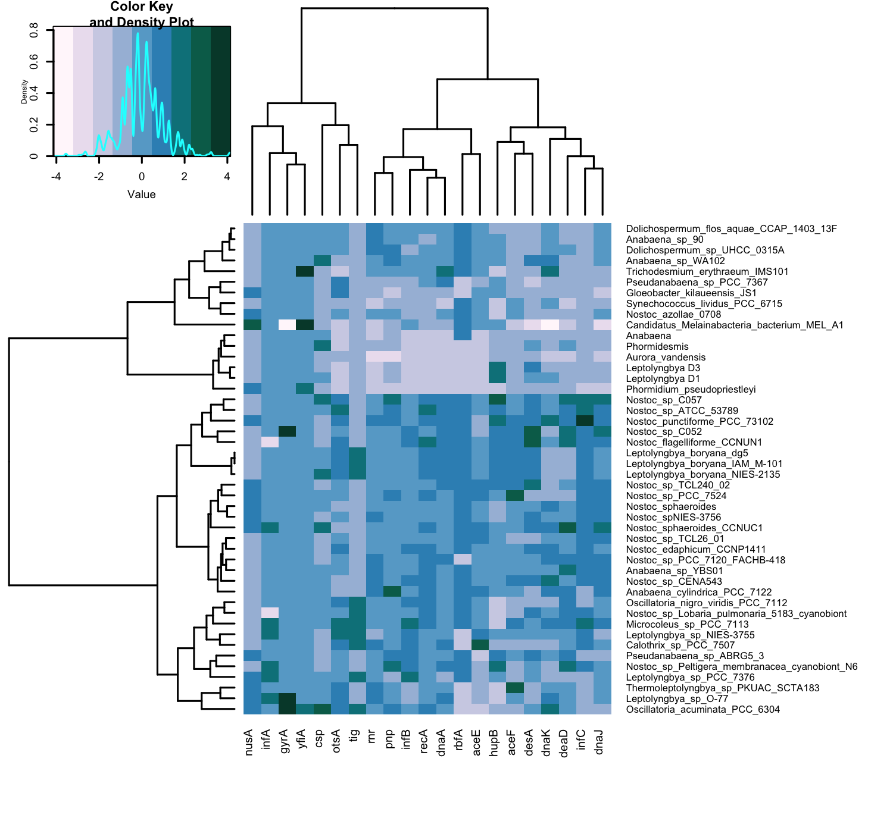

```{r setup, include=FALSE}
knitr::opts_chunk$set(echo = TRUE)
```

```{r message=FALSE}
#install.packages("viridisLite")
#install.packages("svglite")
#install.packages("factoextra")
#install.packages("cluster")
#install.packages("ggdendro")
#install.packages("grid")
```

## Load the Libraries

```{r message=FALSE}
library(tidyverse)
library(RColorBrewer)
library(paletteer)
library(janitor)
library(here)
library(skimr)
#library(viridis)
#library(shiny)
#library(shinydashboard)
library(devtools)
library(svglite)
#library(cluster)
#library(factoextra)
library(ggdendro)
library(grid)
library(gplots)
```

```{r message=FALSE}
filament_cyanos <- readr::read_csv("data/filamentous_cyano_meta.csv")
```
## Get an Idea of the Structure
```{r}
# summary(filament_cyanos)
```

```{r}
head(filament_cyanos)
```

```{r}
filament_cyanos <- clean_names(filament_cyanos)
```

```{r}
names(filament_cyanos)
```
## Select needed columns (values) from metadata

```{r}
gene_data_organism <- filament_cyanos %>% 
  select(organism, contains("gene_")) %>% 
  pivot_longer(-organism,
               names_to = "gene",
               values_to = "gene_count") %>% 
  filter(!is.na(gene_count))
gene_data_organism
```

## Heatmap

```{r message=FALSE}
gene_data_organism$gene_count <- as.numeric(gene_data_organism$gene_count) # needs to be numeric for scale()
lapply(gene_data_organism, class)
```

```{r}
clust_map_org <- gene_data_organism %>% # make pivot_wider for scale()
  pivot_wider(names_from = "gene",
              values_from = "gene_count")
  
names(clust_map_org) = gsub(pattern = "gene_", replacement = "", x = names(clust_map_org))
names(clust_map_org) = gsub(pattern = "_", replacement = " ", x = names(clust_map_org))

clust_map_org
```

```{r}
scaled_clust_map <- clust_map_org 
scaled_clust_map[, c(2:22)] <- scale(scaled_clust_map[, 2:22])

scaled_clust_map
```

```{r echo=FALSE}
# lapply(scaled_clust_map, class) # was having trouble with class switching
```

```{r}
rnames <- scaled_clust_map[,1] # made singe column to use as rownames
rnames
```

```{r message=FALSE}
organisim <- as.list(rnames) # changed to list so I could add to matrix, did not work so I wrote them all out to make a vactor. I think there is a problem with the title "organism"
organisim
```

### Convert dataframe to matrix with heatmap.2 from gplots
```{r message=FALSE}
mat_data <- data.matrix(scaled_clust_map[,2:ncol(scaled_clust_map)])
mat_data[is.na(mat_data)] <- 0
mat_data[,colnames(mat_data)!="organism"]
#rownames(mat_data) <- rnames   # this does not work, gives error: 
```

```{r message=FALSE}
rownames(mat_data) <- c("Nostoc punctiforme PCC 73102", "Oscillatoria acuminata PCC 6304", "Oscillatoria nigro-viridis PCC 7112", "Nostoc flagelliforme CCNUN1", "Trichodesmium erythraeum IMS101", "Nostoc sphaeroides", "Leptolyngbya boryana NIES-2135", "Nostoc azollae' 0708", "Dolichospermum flos-aquae CCAP 1403/13F", "Anabaena cylindrica PCC 7122", "Nostoc sp. 'Peltigera membranacea cyanobiont' N6", "Nostoc sp. TCL240-02", "Nostoc sp. C052", "Nostoc edaphicum CCNP1411",  "Nostoc sp. C057", "Microcoleus sp. PCC 7113", "Nostoc sp. ATCC 53789",  "Nostoc sp. 'Lobaria pulmonaria (5183) cyanobiont'", "Calothrix sp. PCC 7507",  "Anabaena sp. YBS01",  "Nostoc sp. CENA543", "Nostoc sp. TCL26-01",  "Nostoc sp. PCC 7524", "Nostoc sphaeroides CCNUC1", "Nostoc sp. NIES-3756", "Nostoc sp. PCC 7120 = FACHB-418", "Leptolyngbya sp. NIES-3755","Leptolyngbya boryana dg5",  "Leptolyngbya boryana IAM M-101",  "Anabaena sp. WA102", "Thermoleptolyngbya sp. PKUAC-SCTA183", "Leptolyngbya sp. O-77",  "Dolichospermum sp. UHCC 0315A", "Leptolyngbya sp. PCC 7376", "Pseudanabaena sp. ABRG5-3", "Pseudanabaena sp. PCC 7367", "Anabaena sp. 90", "Leptolyngbya D1", "Phormidesmis", "Leptolyngbya D3", "Anabaena")

mat_data
```

```{r echo=FALSE}
#matrix.please<-function(scaled_clust_map) {
    #m<-as.matrix(scaled_clust_map[,-1])
    #rownames(m)<-scaled_clust_map[,1]
    #m
#}
#M <- matrix.please(scaled_clust_map)
#str(M)
```

```{r echo=FALSE}
#matrix_heatmap <- data.matrix(scaled_clust_map)
#matrix_heatmap[is.na(matrix_heatmap)] <- 0
#matrix_heatmap <- data.matrix(scaled_clust_map, as.numeric)
#matrix_heatmap
```

```{r message=FALSE}
png(file="fil_matrix_heatmap.png",
    width = 5*300,        # 5 x 300 pixels
    height = 5*275,
    res = 300,            # 300 pixels per inch
    pointsize = 6)        # smaller font size)

row_distance = dist(mat_data, method = "manhattan") #I dont understand distance so I'm not going to use it yet.
row_cluster = hclust(row_distance, method = "ward.D")
col_distance = dist(t(mat_data), method = "manhattan")
col_cluster = hclust(col_distance, method = "ward.D")

Colors=brewer.pal(11,"PuBuGn")  
#Colors=c("white","blue", "green")
#Colors=colorRampPalette(Colors)(100)
heatmap.2(mat_data, 
          margins = c(7, 19), # words aren't cut off in png
          trace = "none", # trace is the cyan histogram, get rid of it
          density.info="density", # density plot, not histogram
          col=Colors,
          Rowv = as.dendrogram(row_cluster), # changing the cluster and distance methods from the default
          Colv = as.dendrogram(col_cluster)) 
dev.off()
```

```{r echo = FALSE}

```

