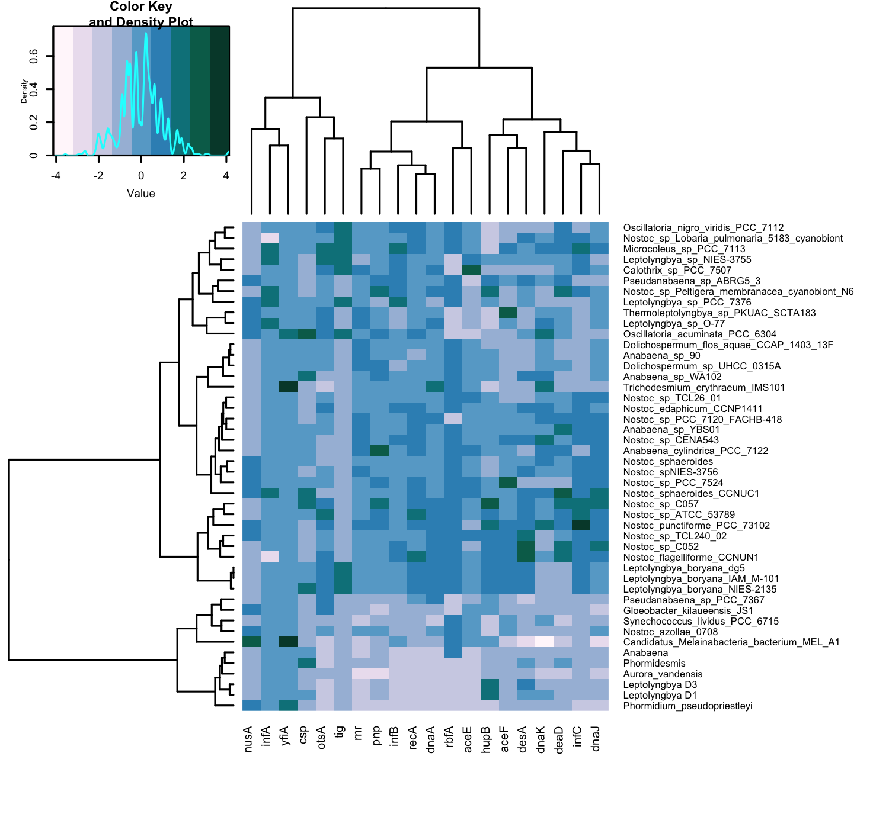

```r
#install.packages("viridisLite")
#install.packages("svglite")
#install.packages("factoextra")
#install.packages("cluster")
#install.packages("ggdendro")
#install.packages("grid")
```

## Load the Libraries


```r
library(tidyverse)
library(RColorBrewer)
library(paletteer)
library(janitor)
library(here)
library(skimr)
#library(viridis)
#library(shiny)
#library(shinydashboard)
library(devtools)
library(svglite)
#library(cluster)
#library(factoextra)
library(ggdendro)
library(grid)
library(gplots)
```


```r
filament_cyanos <- readr::read_csv("data/hmms_CTG_matrix.csv")
```


```r
summary(filament_cyanos)
```

```
##  genome_or_bin           gyrA            nusA            infC      
##  Length:46          Min.   :1.000   Min.   :1.000   Min.   :0.000  
##  Class :character   1st Qu.:2.000   1st Qu.:1.000   1st Qu.:1.000  
##  Mode  :character   Median :2.000   Median :1.000   Median :1.500  
##                     Mean   :2.043   Mean   :1.348   Mean   :1.609  
##                     3rd Qu.:2.000   3rd Qu.:2.000   3rd Qu.:2.000  
##                     Max.   :3.000   Max.   :3.000   Max.   :5.000  
##       infA            otsA            dnaK             recA      
##  Min.   :0.000   Min.   :0.000   Min.   : 1.000   Min.   : 1.00  
##  1st Qu.:1.000   1st Qu.:1.250   1st Qu.: 8.000   1st Qu.:19.50  
##  Median :1.000   Median :3.000   Median : 9.000   Median :25.50  
##  Mean   :1.087   Mean   :3.457   Mean   : 9.109   Mean   :22.93  
##  3rd Qu.:1.000   3rd Qu.:5.000   3rd Qu.:10.750   3rd Qu.:30.00  
##  Max.   :2.000   Max.   :8.000   Max.   :14.000   Max.   :47.00  
##       dnaJ            aceF            deaD            infB       
##  Min.   : 3.00   Min.   :0.000   Min.   : 6.00   Min.   : 5.000  
##  1st Qu.:10.00   1st Qu.:1.000   1st Qu.:14.00   1st Qu.: 7.000  
##  Median :12.50   Median :2.000   Median :16.50   Median : 8.000  
##  Mean   :12.04   Mean   :1.804   Mean   :18.26   Mean   : 7.696  
##  3rd Qu.:14.00   3rd Qu.:2.000   3rd Qu.:22.00   3rd Qu.: 8.000  
##  Max.   :18.00   Max.   :4.000   Max.   :36.00   Max.   :10.000  
##       tig             rnr             dnaA            hupB      
##  Min.   :1.000   Min.   :1.000   Min.   : 1.00   Min.   :1.000  
##  1st Qu.:1.000   1st Qu.:5.000   1st Qu.:15.00   1st Qu.:2.000  
##  Median :1.000   Median :5.000   Median :17.50   Median :3.000  
##  Mean   :1.217   Mean   :4.652   Mean   :16.30   Mean   :2.848  
##  3rd Qu.:1.000   3rd Qu.:5.750   3rd Qu.:20.75   3rd Qu.:4.000  
##  Max.   :2.000   Max.   :6.000   Max.   :32.00   Max.   :6.000  
##       rbfA            yfiA             pnp             csp        
##  Min.   :1.000   Min.   :0.0000   Min.   :2.000   Min.   :0.0000  
##  1st Qu.:1.000   1st Qu.:0.0000   1st Qu.:6.000   1st Qu.:0.0000  
##  Median :2.000   Median :0.0000   Median :6.000   Median :1.0000  
##  Mean   :1.717   Mean   :0.1304   Mean   :5.783   Mean   :0.6957  
##  3rd Qu.:2.000   3rd Qu.:0.0000   3rd Qu.:6.000   3rd Qu.:1.0000  
##  Max.   :2.000   Max.   :2.0000   Max.   :9.000   Max.   :3.0000  
##       aceE            desA       
##  Min.   :1.000   Min.   : 0.000  
##  1st Qu.:2.000   1st Qu.: 6.000  
##  Median :3.000   Median : 7.000  
##  Mean   :2.674   Mean   : 7.478  
##  3rd Qu.:3.000   3rd Qu.: 9.000  
##  Max.   :5.000   Max.   :15.000
```


```r
head(filament_cyanos)
```

```
## # A tibble: 6 × 22
##   genome_or_…¹  gyrA  nusA  infC  infA  otsA  dnaK  recA  dnaJ  aceF  deaD  infB
##   <chr>        <dbl> <dbl> <dbl> <dbl> <dbl> <dbl> <dbl> <dbl> <dbl> <dbl> <dbl>
## 1 Anabaena_cy…     2     1     1     1     1    11    28    14     2    25     8
## 2 Anabaena_sp…     2     1     1     1     4    10    16    12     1    15     8
## 3 Anabaena_sp…     2     1     1     1     1    11    24    12     1    15     8
## 4 Anabaena_sp…     2     1     2     1     3     9    31    14     2    29     8
## 5 Aurora_vand…     2     1     1     1     1     5     1     7     1     8     5
## 6 Calothrix_s…     2     1     2     1     5     8    26    13     1    21     9
## # … with 10 more variables: tig <dbl>, rnr <dbl>, dnaA <dbl>, hupB <dbl>,
## #   rbfA <dbl>, yfiA <dbl>, pnp <dbl>, csp <dbl>, aceE <dbl>, desA <dbl>, and
## #   abbreviated variable name ¹​genome_or_bin
```


```r
filament_cyanos_rows <- filament_cyanos %>% 
  remove_rownames %>%      # making first column into the row names. When converted into matrix names will be there already
  column_to_rownames(var="genome_or_bin")
filament_cyanos_rows
```

```
##                                               gyrA nusA infC infA otsA dnaK
## Anabaena_cylindrica_PCC_7122                     2    1    1    1    1   11
## Anabaena_sp_90                                   2    1    1    1    4   10
## Anabaena_sp_WA102                                2    1    1    1    1   11
## Anabaena_sp_YBS01                                2    1    2    1    3    9
## Aurora_vandensis                                 2    1    1    1    1    5
## Calothrix_sp_PCC_7507                            2    1    2    1    5    8
## Candidatus_Melainabacteria_bacterium_MEL_A1      1    3    1    1    0    1
## Dolichospermum_flos_aquae_CCAP_1403_13F          2    1    1    1    3    9
## Dolichospermum_sp_UHCC_0315A                     2    1    1    1    4    9
## Gloeobacter_kilaueensis_JS1                      2    2    1    1    6    7
## Leptolyngbya_boryana_IAM_M-101                   2    1    2    1    6    8
## Leptolyngbya_boryana_NIES-2135                   2    1    2    1    6    8
## Leptolyngbya_boryana_dg5                         2    1    2    1    6    8
## Leptolyngbya_sp_NIES-3755                        2    1    2    2    8    9
## Leptolyngbya_sp_O-77                             3    2    1    2    5   11
## Leptolyngbya_sp_PCC_7376                         2    2    1    2    3    8
## Microcoleus_sp_PCC_7113                          2    1    3    2    7   12
## Nostoc_azollae_0708                              2    2    1    1    3    8
## Nostoc_edaphicum_CCNP1411                        2    1    2    1    5   11
## Nostoc_flagelliforme_CCNUN1                      2    1    2    0    5    9
## Nostoc_punctiforme_PCC_73102                     2    2    5    1    5   13
## Nostoc_spNIES-3756                               2    2    2    1    3    9
## Nostoc_sp_ATCC_53789                             2    1    3    1    7    9
## Nostoc_sp_C052                                   3    1    2    1    3    8
## Nostoc_sp_C057                                   2    1    3    1    6   10
## Nostoc_sp_CENA543                                2    1    2    1    2   14
## Nostoc_sp_Lobaria_pulmonaria_5183_cyanobiont     2    1    2    0    4   10
## Nostoc_sp_PCC_7120_FACHB-418                     2    1    2    1    3   11
## Nostoc_sp_PCC_7524                               2    2    2    1    3    8
## Nostoc_sp_Peltigera_membranacea_cyanobiont_N6    2    1    2    2    3    8
## Nostoc_sp_TCL240_02                              2    2    2    1    4    8
## Nostoc_sp_TCL26_01                               2    1    2    1    4   10
## Nostoc_sphaeroides                               2    2    2    1    1   11
## Nostoc_sphaeroides_CCNUC1                        2    2    2    2    2   12
## Oscillatoria_acuminata_PCC_6304                  3    2    1    1    6   13
## Oscillatoria_nigro_viridis_PCC_7112              2    1    1    1    5    8
## Phormidium_pseudopriestleyi                      2    2    0    1    0    8
## Pseudanabaena_sp_ABRG5_3                         2    2    1    1    3    9
## Pseudanabaena_sp_PCC_7367                        2    1    1    1    6    8
## Synechococcus_lividus_PCC_6715                   2    1    1    1    1    9
## Thermoleptolyngbya_sp_PKUAC_SCTA183              2    2    1    1    6    9
## Trichodesmium_erythraeum_IMS101                  2    1    1    1    0   13
## Leptolyngbya D1                                  2    1    1    1    0    9
## Phormidesmis                                     2    1    1    1    0    7
## Leptolyngbya D3                                  2    1    1    1    0    7
## Anabaena                                         2    1    1    1    0    6
##                                               recA dnaJ aceF deaD infB tig rnr
## Anabaena_cylindrica_PCC_7122                    28   14    2   25    8   1   6
## Anabaena_sp_90                                  16   12    1   15    8   1   6
## Anabaena_sp_WA102                               24   12    1   15    8   1   5
## Anabaena_sp_YBS01                               31   14    2   29    8   1   6
## Aurora_vandensis                                 1    7    1    8    5   1   1
## Calothrix_sp_PCC_7507                           26   13    1   21    9   2   6
## Candidatus_Melainabacteria_bacterium_MEL_A1      8    3    0    6    8   1   2
## Dolichospermum_flos_aquae_CCAP_1403_13F         23   11    1   15    8   1   6
## Dolichospermum_sp_UHCC_0315A                    21   12    1   16    7   1   6
## Gloeobacter_kilaueensis_JS1                     13    6    1   14    6   1   3
## Leptolyngbya_boryana_IAM_M-101                  30   13    3   14    8   2   5
## Leptolyngbya_boryana_NIES-2135                  31   13    3   14    8   2   5
## Leptolyngbya_boryana_dg5                        30   13    3   14    8   2   5
## Leptolyngbya_sp_NIES-3755                       26   10    2   19    9   2   4
## Leptolyngbya_sp_O-77                            24   13    2   17    7   1   6
## Leptolyngbya_sp_PCC_7376                        19   11    1   11   10   2   5
## Microcoleus_sp_PCC_7113                         33   14    3   23   10   2   5
## Nostoc_azollae_0708                             12   11    2   10    7   1   5
## Nostoc_edaphicum_CCNP1411                       31   13    2   19    9   1   5
## Nostoc_flagelliforme_CCNUN1                     47   15    3   34    9   1   5
## Nostoc_punctiforme_PCC_73102                    28   16    3   23    8   1   6
## Nostoc_spNIES-3756                              23   14    2   19    8   1   6
## Nostoc_sp_ATCC_53789                            42   15    2   22    8   1   5
## Nostoc_sp_C052                                  24   18    3   30    9   1   5
## Nostoc_sp_C057                                  31   17    2   30    8   1   5
## Nostoc_sp_CENA543                               32   14    3   16    9   1   6
## Nostoc_sp_Lobaria_pulmonaria_5183_cyanobiont    28   12    1   22    8   2   5
## Nostoc_sp_PCC_7120_FACHB-418                    28   14    2   22    8   1   6
## Nostoc_sp_PCC_7524                              31   15    4   15    8   1   5
## Nostoc_sp_Peltigera_membranacea_cyanobiont_N6   26   13    1   32    9   1   5
## Nostoc_sp_TCL240_02                             27   14    3   21    8   1   5
## Nostoc_sp_TCL26_01                              26   14    1   18    8   1   5
## Nostoc_sphaeroides                              24   15    2   17    8   1   5
## Nostoc_sphaeroides_CCNUC1                       32   18    2   36    8   1   5
## Oscillatoria_acuminata_PCC_6304                 32   10    1   17    8   2   5
## Oscillatoria_nigro_viridis_PCC_7112             29   11    1   22    9   2   5
## Phormidium_pseudopriestleyi                      3    7    1   10    5   1   2
## Pseudanabaena_sp_ABRG5_3                        25   10    2   22    9   1   5
## Pseudanabaena_sp_PCC_7367                       25   10    1   11    7   1   3
## Synechococcus_lividus_PCC_6715                  15   10    2    8    6   1   2
## Thermoleptolyngbya_sp_PKUAC_SCTA183             25   12    4   16    7   1   6
## Trichodesmium_erythraeum_IMS101                 21    9    1   15    8   1   5
## Leptolyngbya D1                                  1   10    1   14    5   1   2
## Phormidesmis                                     1    8    1   16    5   1   4
## Leptolyngbya D3                                  1    9    1   14    5   1   2
## Anabaena                                         1    9    1   13    5   1   2
##                                               dnaA hupB rbfA yfiA pnp csp aceE
## Anabaena_cylindrica_PCC_7122                    18    3    2    0   9   1    4
## Anabaena_sp_90                                  16    3    2    0   6   1    3
## Anabaena_sp_WA102                               18    3    2    0   7   2    3
## Anabaena_sp_YBS01                               17    3    2    0   6   1    3
## Aurora_vandensis                                 2    2    1    0   2   0    1
## Calothrix_sp_PCC_7507                           20    2    1    0   6   0    5
## Candidatus_Melainabacteria_bacterium_MEL_A1     10    3    2    2   4   0    3
## Dolichospermum_flos_aquae_CCAP_1403_13F         16    2    2    0   6   1    3
## Dolichospermum_sp_UHCC_0315A                    17    3    2    0   7   1    3
## Gloeobacter_kilaueensis_JS1                     12    3    1    0   3   0    3
## Leptolyngbya_boryana_IAM_M-101                  23    4    2    0   6   1    3
## Leptolyngbya_boryana_NIES-2135                  25    4    2    0   6   2    3
## Leptolyngbya_boryana_dg5                        23    4    2    0   6   1    3
## Leptolyngbya_sp_NIES-3755                       19    3    1    0   6   0    4
## Leptolyngbya_sp_O-77                            21    1    1    0   6   1    2
## Leptolyngbya_sp_PCC_7376                        12    3    2    0   5   1    2
## Microcoleus_sp_PCC_7113                         19    1    2    0   6   1    3
## Nostoc_azollae_0708                             15    1    2    0   6   0    3
## Nostoc_edaphicum_CCNP1411                       17    3    2    0   6   0    3
## Nostoc_flagelliforme_CCNUN1                     24    4    2    0   6   0    3
## Nostoc_punctiforme_PCC_73102                    22    5    2    0   7   0    2
## Nostoc_spNIES-3756                              16    2    2    0   6   0    3
## Nostoc_sp_ATCC_53789                            22    4    2    0   7   1    3
## Nostoc_sp_C052                                  23    4    2    0   6   0    2
## Nostoc_sp_C057                                  24    6    2    0   8   2    3
## Nostoc_sp_CENA543                               19    3    2    0   6   1    3
## Nostoc_sp_Lobaria_pulmonaria_5183_cyanobiont    15    1    2    0   6   1    3
## Nostoc_sp_PCC_7120_FACHB-418                    20    3    1    0   6   0    3
## Nostoc_sp_PCC_7524                              16    3    2    0   7   1    4
## Nostoc_sp_Peltigera_membranacea_cyanobiont_N6   22    5    2    0   8   0    2
## Nostoc_sp_TCL240_02                             23    4    2    0   6   0    4
## Nostoc_sp_TCL26_01                              16    3    2    0   6   0    4
## Nostoc_sphaeroides                              15    2    2    0   6   1    3
## Nostoc_sphaeroides_CCNUC1                       19    3    2    0   6   2    4
## Oscillatoria_acuminata_PCC_6304                 15    2    1    1   7   3    1
## Oscillatoria_nigro_viridis_PCC_7112             16    1    2    0   6   1    3
## Phormidium_pseudopriestleyi                      1    1    1    1   3   0    1
## Pseudanabaena_sp_ABRG5_3                        19    4    2    0   7   0    1
## Pseudanabaena_sp_PCC_7367                       20    3    1    0   5   0    2
## Synechococcus_lividus_PCC_6715                   6    1    2    0   4   0    3
## Thermoleptolyngbya_sp_PKUAC_SCTA183             18    1    1    0   6   1    2
## Trichodesmium_erythraeum_IMS101                 32    1    2    2   6   0    3
## Leptolyngbya D1                                  1    5    1    0   4   1    1
## Phormidesmis                                     3    2    1    0   4   2    1
## Leptolyngbya D3                                  1    5    1    0   4   0    1
## Anabaena                                         2    2    2    0   4   1    1
##                                               desA
## Anabaena_cylindrica_PCC_7122                     5
## Anabaena_sp_90                                   6
## Anabaena_sp_WA102                                9
## Anabaena_sp_YBS01                                7
## Aurora_vandensis                                 6
## Calothrix_sp_PCC_7507                            6
## Candidatus_Melainabacteria_bacterium_MEL_A1      0
## Dolichospermum_flos_aquae_CCAP_1403_13F          6
## Dolichospermum_sp_UHCC_0315A                     5
## Gloeobacter_kilaueensis_JS1                      5
## Leptolyngbya_boryana_IAM_M-101                  10
## Leptolyngbya_boryana_NIES-2135                  10
## Leptolyngbya_boryana_dg5                        10
## Leptolyngbya_sp_NIES-3755                        8
## Leptolyngbya_sp_O-77                             6
## Leptolyngbya_sp_PCC_7376                         8
## Microcoleus_sp_PCC_7113                          7
## Nostoc_azollae_0708                              4
## Nostoc_edaphicum_CCNP1411                       10
## Nostoc_flagelliforme_CCNUN1                     15
## Nostoc_punctiforme_PCC_73102                    11
## Nostoc_spNIES-3756                               9
## Nostoc_sp_ATCC_53789                             9
## Nostoc_sp_C052                                  14
## Nostoc_sp_C057                                  10
## Nostoc_sp_CENA543                                9
## Nostoc_sp_Lobaria_pulmonaria_5183_cyanobiont     9
## Nostoc_sp_PCC_7120_FACHB-418                     7
## Nostoc_sp_PCC_7524                               5
## Nostoc_sp_Peltigera_membranacea_cyanobiont_N6    7
## Nostoc_sp_TCL240_02                             12
## Nostoc_sp_TCL26_01                               6
## Nostoc_sphaeroides                               7
## Nostoc_sphaeroides_CCNUC1                        9
## Oscillatoria_acuminata_PCC_6304                  7
## Oscillatoria_nigro_viridis_PCC_7112              6
## Phormidium_pseudopriestleyi                      6
## Pseudanabaena_sp_ABRG5_3                         9
## Pseudanabaena_sp_PCC_7367                        3
## Synechococcus_lividus_PCC_6715                   5
## Thermoleptolyngbya_sp_PKUAC_SCTA183              6
## Trichodesmium_erythraeum_IMS101                  4
## Leptolyngbya D1                                  8
## Phormidesmis                                     8
## Leptolyngbya D3                                 10
## Anabaena                                         5
```


```r
names(filament_cyanos_rows)
```

```
##  [1] "gyrA" "nusA" "infC" "infA" "otsA" "dnaK" "recA" "dnaJ" "aceF" "deaD"
## [11] "infB" "tig"  "rnr"  "dnaA" "hupB" "rbfA" "yfiA" "pnp"  "csp"  "aceE"
## [21] "desA"
```


```r
filament_cyanos_scaled <- filament_cyanos_rows 
filament_cyanos_scaled <- scale(filament_cyanos_scaled)
filament_cyanos_scaled[is.na(filament_cyanos_scaled)] <- 0

# filament_cyanos_scaled
```


```r
filament_cyanos_matrix <- data.matrix(filament_cyanos_scaled[,2:ncol(filament_cyanos_scaled)])
filament_cyanos_matrix[is.na(filament_cyanos_matrix)] <- 0
filament_cyanos_matrix[,colnames(filament_cyanos_matrix)!="genome_or_bin"]
```

```
##                                                    nusA       infC       infA
## Anabaena_cylindrica_PCC_7122                  -0.661682 -0.7338890 -0.2108706
## Anabaena_sp_90                                -0.661682 -0.7338890 -0.2108706
## Anabaena_sp_WA102                             -0.661682 -0.7338890 -0.2108706
## Anabaena_sp_YBS01                             -0.661682  0.4717858 -0.2108706
## Aurora_vandensis                              -0.661682 -0.7338890 -0.2108706
## Calothrix_sp_PCC_7507                         -0.661682  0.4717858 -0.2108706
## Candidatus_Melainabacteria_bacterium_MEL_A1    3.142989 -0.7338890 -0.2108706
## Dolichospermum_flos_aquae_CCAP_1403_13F       -0.661682 -0.7338890 -0.2108706
## Dolichospermum_sp_UHCC_0315A                  -0.661682 -0.7338890 -0.2108706
## Gloeobacter_kilaueensis_JS1                    1.240654 -0.7338890 -0.2108706
## Leptolyngbya_boryana_IAM_M-101                -0.661682  0.4717858 -0.2108706
## Leptolyngbya_boryana_NIES-2135                -0.661682  0.4717858 -0.2108706
## Leptolyngbya_boryana_dg5                      -0.661682  0.4717858 -0.2108706
## Leptolyngbya_sp_NIES-3755                     -0.661682  0.4717858  2.2141411
## Leptolyngbya_sp_O-77                           1.240654 -0.7338890  2.2141411
## Leptolyngbya_sp_PCC_7376                       1.240654 -0.7338890  2.2141411
## Microcoleus_sp_PCC_7113                       -0.661682  1.6774606  2.2141411
## Nostoc_azollae_0708                            1.240654 -0.7338890 -0.2108706
## Nostoc_edaphicum_CCNP1411                     -0.661682  0.4717858 -0.2108706
## Nostoc_flagelliforme_CCNUN1                   -0.661682  0.4717858 -2.6358823
## Nostoc_punctiforme_PCC_73102                   1.240654  4.0888101 -0.2108706
## Nostoc_spNIES-3756                             1.240654  0.4717858 -0.2108706
## Nostoc_sp_ATCC_53789                          -0.661682  1.6774606 -0.2108706
## Nostoc_sp_C052                                -0.661682  0.4717858 -0.2108706
## Nostoc_sp_C057                                -0.661682  1.6774606 -0.2108706
## Nostoc_sp_CENA543                             -0.661682  0.4717858 -0.2108706
## Nostoc_sp_Lobaria_pulmonaria_5183_cyanobiont  -0.661682  0.4717858 -2.6358823
## Nostoc_sp_PCC_7120_FACHB-418                  -0.661682  0.4717858 -0.2108706
## Nostoc_sp_PCC_7524                             1.240654  0.4717858 -0.2108706
## Nostoc_sp_Peltigera_membranacea_cyanobiont_N6 -0.661682  0.4717858  2.2141411
## Nostoc_sp_TCL240_02                            1.240654  0.4717858 -0.2108706
## Nostoc_sp_TCL26_01                            -0.661682  0.4717858 -0.2108706
## Nostoc_sphaeroides                             1.240654  0.4717858 -0.2108706
## Nostoc_sphaeroides_CCNUC1                      1.240654  0.4717858  2.2141411
## Oscillatoria_acuminata_PCC_6304                1.240654 -0.7338890 -0.2108706
## Oscillatoria_nigro_viridis_PCC_7112           -0.661682 -0.7338890 -0.2108706
## Phormidium_pseudopriestleyi                    1.240654 -1.9395638 -0.2108706
## Pseudanabaena_sp_ABRG5_3                       1.240654 -0.7338890 -0.2108706
## Pseudanabaena_sp_PCC_7367                     -0.661682 -0.7338890 -0.2108706
## Synechococcus_lividus_PCC_6715                -0.661682 -0.7338890 -0.2108706
## Thermoleptolyngbya_sp_PKUAC_SCTA183            1.240654 -0.7338890 -0.2108706
## Trichodesmium_erythraeum_IMS101               -0.661682 -0.7338890 -0.2108706
## Leptolyngbya D1                               -0.661682 -0.7338890 -0.2108706
## Phormidesmis                                  -0.661682 -0.7338890 -0.2108706
## Leptolyngbya D3                               -0.661682 -0.7338890 -0.2108706
## Anabaena                                      -0.661682 -0.7338890 -0.2108706
##                                                     otsA        dnaK
## Anabaena_cylindrica_PCC_7122                  -1.0786097  0.83214079
## Anabaena_sp_90                                 0.2386305  0.39215830
## Anabaena_sp_WA102                             -1.0786097  0.83214079
## Anabaena_sp_YBS01                             -0.2004496 -0.04782418
## Aurora_vandensis                              -1.0786097 -1.80775413
## Calothrix_sp_PCC_7507                          0.6777105 -0.48780667
## Candidatus_Melainabacteria_bacterium_MEL_A1   -1.5176897 -3.56768407
## Dolichospermum_flos_aquae_CCAP_1403_13F       -0.2004496 -0.04782418
## Dolichospermum_sp_UHCC_0315A                   0.2386305 -0.04782418
## Gloeobacter_kilaueensis_JS1                    1.1167905 -0.92778916
## Leptolyngbya_boryana_IAM_M-101                 1.1167905 -0.48780667
## Leptolyngbya_boryana_NIES-2135                 1.1167905 -0.48780667
## Leptolyngbya_boryana_dg5                       1.1167905 -0.48780667
## Leptolyngbya_sp_NIES-3755                      1.9949506 -0.04782418
## Leptolyngbya_sp_O-77                           0.6777105  0.83214079
## Leptolyngbya_sp_PCC_7376                      -0.2004496 -0.48780667
## Microcoleus_sp_PCC_7113                        1.5558706  1.27212327
## Nostoc_azollae_0708                           -0.2004496 -0.48780667
## Nostoc_edaphicum_CCNP1411                      0.6777105  0.83214079
## Nostoc_flagelliforme_CCNUN1                    0.6777105 -0.04782418
## Nostoc_punctiforme_PCC_73102                   0.6777105  1.71210576
## Nostoc_spNIES-3756                            -0.2004496 -0.04782418
## Nostoc_sp_ATCC_53789                           1.5558706 -0.04782418
## Nostoc_sp_C052                                -0.2004496 -0.48780667
## Nostoc_sp_C057                                 1.1167905  0.39215830
## Nostoc_sp_CENA543                             -0.6395296  2.15208825
## Nostoc_sp_Lobaria_pulmonaria_5183_cyanobiont   0.2386305  0.39215830
## Nostoc_sp_PCC_7120_FACHB-418                  -0.2004496  0.83214079
## Nostoc_sp_PCC_7524                            -0.2004496 -0.48780667
## Nostoc_sp_Peltigera_membranacea_cyanobiont_N6 -0.2004496 -0.48780667
## Nostoc_sp_TCL240_02                            0.2386305 -0.48780667
## Nostoc_sp_TCL26_01                             0.2386305  0.39215830
## Nostoc_sphaeroides                            -1.0786097  0.83214079
## Nostoc_sphaeroides_CCNUC1                     -0.6395296  1.27212327
## Oscillatoria_acuminata_PCC_6304                1.1167905  1.71210576
## Oscillatoria_nigro_viridis_PCC_7112            0.6777105 -0.48780667
## Phormidium_pseudopriestleyi                   -1.5176897 -0.48780667
## Pseudanabaena_sp_ABRG5_3                      -0.2004496 -0.04782418
## Pseudanabaena_sp_PCC_7367                      1.1167905 -0.48780667
## Synechococcus_lividus_PCC_6715                -1.0786097 -0.04782418
## Thermoleptolyngbya_sp_PKUAC_SCTA183            1.1167905 -0.04782418
## Trichodesmium_erythraeum_IMS101               -1.5176897  1.71210576
## Leptolyngbya D1                               -1.5176897 -0.04782418
## Phormidesmis                                  -1.5176897 -0.92778916
## Leptolyngbya D3                               -1.5176897 -0.92778916
## Anabaena                                      -1.5176897 -1.36777164
##                                                       recA        dnaJ
## Anabaena_cylindrica_PCC_7122                   0.466519349  0.63596097
## Anabaena_sp_90                                -0.638711040 -0.01413247
## Anabaena_sp_WA102                              0.098109219 -0.01413247
## Anabaena_sp_YBS01                              0.742826946  0.63596097
## Aurora_vandensis                              -2.020249026 -1.63936606
## Calothrix_sp_PCC_7507                          0.282314284  0.31091425
## Candidatus_Melainabacteria_bacterium_MEL_A1   -1.375531299 -2.93955294
## Dolichospermum_flos_aquae_CCAP_1403_13F        0.006006687 -0.33917919
## Dolichospermum_sp_UHCC_0315A                  -0.178198378 -0.01413247
## Gloeobacter_kilaueensis_JS1                   -0.915018637 -1.96441278
## Leptolyngbya_boryana_IAM_M-101                 0.650724414  0.31091425
## Leptolyngbya_boryana_NIES-2135                 0.742826946  0.31091425
## Leptolyngbya_boryana_dg5                       0.650724414  0.31091425
## Leptolyngbya_sp_NIES-3755                      0.282314284 -0.66422590
## Leptolyngbya_sp_O-77                           0.098109219  0.31091425
## Leptolyngbya_sp_PCC_7376                      -0.362403443 -0.33917919
## Microcoleus_sp_PCC_7113                        0.927032011  0.63596097
## Nostoc_azollae_0708                           -1.007121169 -0.33917919
## Nostoc_edaphicum_CCNP1411                      0.742826946  0.31091425
## Nostoc_flagelliforme_CCNUN1                    2.216467464  0.96100769
## Nostoc_punctiforme_PCC_73102                   0.466519349  1.28605441
## Nostoc_spNIES-3756                             0.006006687  0.63596097
## Nostoc_sp_ATCC_53789                           1.755954802  0.96100769
## Nostoc_sp_C052                                 0.098109219  1.93614785
## Nostoc_sp_C057                                 0.742826946  1.61110113
## Nostoc_sp_CENA543                              0.834929478  0.63596097
## Nostoc_sp_Lobaria_pulmonaria_5183_cyanobiont   0.466519349 -0.01413247
## Nostoc_sp_PCC_7120_FACHB-418                   0.466519349  0.63596097
## Nostoc_sp_PCC_7524                             0.742826946  0.96100769
## Nostoc_sp_Peltigera_membranacea_cyanobiont_N6  0.282314284  0.31091425
## Nostoc_sp_TCL240_02                            0.374416816  0.63596097
## Nostoc_sp_TCL26_01                             0.282314284  0.63596097
## Nostoc_sphaeroides                             0.098109219  0.96100769
## Nostoc_sphaeroides_CCNUC1                      0.834929478  1.93614785
## Oscillatoria_acuminata_PCC_6304                0.834929478 -0.66422590
## Oscillatoria_nigro_viridis_PCC_7112            0.558621881 -0.33917919
## Phormidium_pseudopriestleyi                   -1.836043961 -1.63936606
## Pseudanabaena_sp_ABRG5_3                       0.190211752 -0.66422590
## Pseudanabaena_sp_PCC_7367                      0.190211752 -0.66422590
## Synechococcus_lividus_PCC_6715                -0.730813572 -0.66422590
## Thermoleptolyngbya_sp_PKUAC_SCTA183            0.190211752 -0.01413247
## Trichodesmium_erythraeum_IMS101               -0.178198378 -0.98927262
## Leptolyngbya D1                               -2.020249026 -0.66422590
## Phormidesmis                                  -2.020249026 -1.31431934
## Leptolyngbya D3                               -2.020249026 -0.98927262
## Anabaena                                      -2.020249026 -0.98927262
##                                                     aceF        deaD       infB
## Anabaena_cylindrica_PCC_7122                   0.2095228  0.97796005  0.2286339
## Anabaena_sp_90                                -0.8613714 -0.47320647  0.2286339
## Anabaena_sp_WA102                             -0.8613714 -0.47320647  0.2286339
## Anabaena_sp_YBS01                              0.2095228  1.55842665  0.2286339
## Aurora_vandensis                              -0.8613714 -1.48902304 -2.0250435
## Calothrix_sp_PCC_7507                         -0.8613714  0.39749344  0.9798598
## Candidatus_Melainabacteria_bacterium_MEL_A1   -1.9322656 -1.77925634  0.2286339
## Dolichospermum_flos_aquae_CCAP_1403_13F       -0.8613714 -0.47320647  0.2286339
## Dolichospermum_sp_UHCC_0315A                  -0.8613714 -0.32808982 -0.5225919
## Gloeobacter_kilaueensis_JS1                   -0.8613714 -0.61832313 -1.2738177
## Leptolyngbya_boryana_IAM_M-101                 1.2804170 -0.61832313  0.2286339
## Leptolyngbya_boryana_NIES-2135                 1.2804170 -0.61832313  0.2286339
## Leptolyngbya_boryana_dg5                       1.2804170 -0.61832313  0.2286339
## Leptolyngbya_sp_NIES-3755                      0.2095228  0.10726013  0.9798598
## Leptolyngbya_sp_O-77                           0.2095228 -0.18297317 -0.5225919
## Leptolyngbya_sp_PCC_7376                      -0.8613714 -1.05367308  1.7310856
## Microcoleus_sp_PCC_7113                        1.2804170  0.68772674  1.7310856
## Nostoc_azollae_0708                            0.2095228 -1.19878973 -0.5225919
## Nostoc_edaphicum_CCNP1411                      0.2095228  0.10726013  0.9798598
## Nostoc_flagelliforme_CCNUN1                    1.2804170  2.28400991  0.9798598
## Nostoc_punctiforme_PCC_73102                   1.2804170  0.68772674  0.2286339
## Nostoc_spNIES-3756                             0.2095228  0.10726013  0.2286339
## Nostoc_sp_ATCC_53789                           0.2095228  0.54261009  0.2286339
## Nostoc_sp_C052                                 1.2804170  1.70354331  0.9798598
## Nostoc_sp_C057                                 0.2095228  1.70354331  0.2286339
## Nostoc_sp_CENA543                              1.2804170 -0.32808982  0.9798598
## Nostoc_sp_Lobaria_pulmonaria_5183_cyanobiont  -0.8613714  0.54261009  0.2286339
## Nostoc_sp_PCC_7120_FACHB-418                   0.2095228  0.54261009  0.2286339
## Nostoc_sp_PCC_7524                             2.3513112 -0.47320647  0.2286339
## Nostoc_sp_Peltigera_membranacea_cyanobiont_N6 -0.8613714  1.99377661  0.9798598
## Nostoc_sp_TCL240_02                            1.2804170  0.39749344  0.2286339
## Nostoc_sp_TCL26_01                            -0.8613714 -0.03785652  0.2286339
## Nostoc_sphaeroides                             0.2095228 -0.18297317  0.2286339
## Nostoc_sphaeroides_CCNUC1                      0.2095228  2.57424322  0.2286339
## Oscillatoria_acuminata_PCC_6304               -0.8613714 -0.18297317  0.2286339
## Oscillatoria_nigro_viridis_PCC_7112           -0.8613714  0.54261009  0.9798598
## Phormidium_pseudopriestleyi                   -0.8613714 -1.19878973 -2.0250435
## Pseudanabaena_sp_ABRG5_3                       0.2095228  0.54261009  0.9798598
## Pseudanabaena_sp_PCC_7367                     -0.8613714 -1.05367308 -0.5225919
## Synechococcus_lividus_PCC_6715                 0.2095228 -1.48902304 -1.2738177
## Thermoleptolyngbya_sp_PKUAC_SCTA183            2.3513112 -0.32808982 -0.5225919
## Trichodesmium_erythraeum_IMS101               -0.8613714 -0.47320647  0.2286339
## Leptolyngbya D1                               -0.8613714 -0.61832313 -2.0250435
## Phormidesmis                                  -0.8613714 -0.32808982 -2.0250435
## Leptolyngbya D3                               -0.8613714 -0.61832313 -2.0250435
## Anabaena                                      -0.8613714 -0.76343978 -2.0250435
##                                                     tig        rnr        dnaA
## Anabaena_cylindrica_PCC_7122                  -0.521286  0.9725140  0.23688521
## Anabaena_sp_90                                -0.521286  0.9725140 -0.04251786
## Anabaena_sp_WA102                             -0.521286  0.2509713  0.23688521
## Anabaena_sp_YBS01                             -0.521286  0.9725140  0.09718368
## Aurora_vandensis                              -0.521286 -2.6351991 -1.99833932
## Calothrix_sp_PCC_7507                          1.876630  0.9725140  0.51628827
## Candidatus_Melainabacteria_bacterium_MEL_A1   -0.521286 -1.9136565 -0.88072706
## Dolichospermum_flos_aquae_CCAP_1403_13F       -0.521286  0.9725140 -0.04251786
## Dolichospermum_sp_UHCC_0315A                  -0.521286  0.9725140  0.09718368
## Gloeobacter_kilaueensis_JS1                   -0.521286 -1.1921139 -0.60132399
## Leptolyngbya_boryana_IAM_M-101                 1.876630  0.2509713  0.93539287
## Leptolyngbya_boryana_NIES-2135                 1.876630  0.2509713  1.21479594
## Leptolyngbya_boryana_dg5                       1.876630  0.2509713  0.93539287
## Leptolyngbya_sp_NIES-3755                      1.876630 -0.4705713  0.37658674
## Leptolyngbya_sp_O-77                          -0.521286  0.9725140  0.65598981
## Leptolyngbya_sp_PCC_7376                       1.876630  0.2509713 -0.60132399
## Microcoleus_sp_PCC_7113                        1.876630  0.2509713  0.37658674
## Nostoc_azollae_0708                           -0.521286  0.2509713 -0.18221939
## Nostoc_edaphicum_CCNP1411                     -0.521286  0.2509713  0.09718368
## Nostoc_flagelliforme_CCNUN1                   -0.521286  0.2509713  1.07509441
## Nostoc_punctiforme_PCC_73102                  -0.521286  0.9725140  0.79569134
## Nostoc_spNIES-3756                            -0.521286  0.9725140 -0.04251786
## Nostoc_sp_ATCC_53789                          -0.521286  0.2509713  0.79569134
## Nostoc_sp_C052                                -0.521286  0.2509713  0.93539287
## Nostoc_sp_C057                                -0.521286  0.2509713  1.07509441
## Nostoc_sp_CENA543                             -0.521286  0.9725140  0.37658674
## Nostoc_sp_Lobaria_pulmonaria_5183_cyanobiont   1.876630  0.2509713 -0.18221939
## Nostoc_sp_PCC_7120_FACHB-418                  -0.521286  0.9725140  0.51628827
## Nostoc_sp_PCC_7524                            -0.521286  0.2509713 -0.04251786
## Nostoc_sp_Peltigera_membranacea_cyanobiont_N6 -0.521286  0.2509713  0.79569134
## Nostoc_sp_TCL240_02                           -0.521286  0.2509713  0.93539287
## Nostoc_sp_TCL26_01                            -0.521286  0.2509713 -0.04251786
## Nostoc_sphaeroides                            -0.521286  0.2509713 -0.18221939
## Nostoc_sphaeroides_CCNUC1                     -0.521286  0.2509713  0.37658674
## Oscillatoria_acuminata_PCC_6304                1.876630  0.2509713 -0.18221939
## Oscillatoria_nigro_viridis_PCC_7112            1.876630  0.2509713 -0.04251786
## Phormidium_pseudopriestleyi                   -0.521286 -1.9136565 -2.13804085
## Pseudanabaena_sp_ABRG5_3                      -0.521286  0.2509713  0.37658674
## Pseudanabaena_sp_PCC_7367                     -0.521286 -1.1921139  0.51628827
## Synechococcus_lividus_PCC_6715                -0.521286 -1.9136565 -1.43953319
## Thermoleptolyngbya_sp_PKUAC_SCTA183           -0.521286  0.9725140  0.23688521
## Trichodesmium_erythraeum_IMS101               -0.521286  0.2509713  2.19270667
## Leptolyngbya D1                               -0.521286 -1.9136565 -2.13804085
## Phormidesmis                                  -0.521286 -0.4705713 -1.85863779
## Leptolyngbya D3                               -0.521286 -1.9136565 -2.13804085
## Anabaena                                      -0.521286 -1.9136565 -1.99833932
##                                                     hupB       rbfA       yfiA
## Anabaena_cylindrica_PCC_7122                   0.1171456  0.6207862 -0.2882011
## Anabaena_sp_90                                 0.1171456  0.6207862 -0.2882011
## Anabaena_sp_WA102                              0.1171456  0.6207862 -0.2882011
## Anabaena_sp_YBS01                              0.1171456  0.6207862 -0.2882011
## Aurora_vandensis                              -0.6526685 -1.5758419 -0.2882011
## Calothrix_sp_PCC_7507                         -0.6526685 -1.5758419 -0.2882011
## Candidatus_Melainabacteria_bacterium_MEL_A1    0.1171456  0.6207862  4.1308827
## Dolichospermum_flos_aquae_CCAP_1403_13F       -0.6526685  0.6207862 -0.2882011
## Dolichospermum_sp_UHCC_0315A                   0.1171456  0.6207862 -0.2882011
## Gloeobacter_kilaueensis_JS1                    0.1171456 -1.5758419 -0.2882011
## Leptolyngbya_boryana_IAM_M-101                 0.8869598  0.6207862 -0.2882011
## Leptolyngbya_boryana_NIES-2135                 0.8869598  0.6207862 -0.2882011
## Leptolyngbya_boryana_dg5                       0.8869598  0.6207862 -0.2882011
## Leptolyngbya_sp_NIES-3755                      0.1171456 -1.5758419 -0.2882011
## Leptolyngbya_sp_O-77                          -1.4224826 -1.5758419 -0.2882011
## Leptolyngbya_sp_PCC_7376                       0.1171456  0.6207862 -0.2882011
## Microcoleus_sp_PCC_7113                       -1.4224826  0.6207862 -0.2882011
## Nostoc_azollae_0708                           -1.4224826  0.6207862 -0.2882011
## Nostoc_edaphicum_CCNP1411                      0.1171456  0.6207862 -0.2882011
## Nostoc_flagelliforme_CCNUN1                    0.8869598  0.6207862 -0.2882011
## Nostoc_punctiforme_PCC_73102                   1.6567739  0.6207862 -0.2882011
## Nostoc_spNIES-3756                            -0.6526685  0.6207862 -0.2882011
## Nostoc_sp_ATCC_53789                           0.8869598  0.6207862 -0.2882011
## Nostoc_sp_C052                                 0.8869598  0.6207862 -0.2882011
## Nostoc_sp_C057                                 2.4265880  0.6207862 -0.2882011
## Nostoc_sp_CENA543                              0.1171456  0.6207862 -0.2882011
## Nostoc_sp_Lobaria_pulmonaria_5183_cyanobiont  -1.4224826  0.6207862 -0.2882011
## Nostoc_sp_PCC_7120_FACHB-418                   0.1171456 -1.5758419 -0.2882011
## Nostoc_sp_PCC_7524                             0.1171456  0.6207862 -0.2882011
## Nostoc_sp_Peltigera_membranacea_cyanobiont_N6  1.6567739  0.6207862 -0.2882011
## Nostoc_sp_TCL240_02                            0.8869598  0.6207862 -0.2882011
## Nostoc_sp_TCL26_01                             0.1171456  0.6207862 -0.2882011
## Nostoc_sphaeroides                            -0.6526685  0.6207862 -0.2882011
## Nostoc_sphaeroides_CCNUC1                      0.1171456  0.6207862 -0.2882011
## Oscillatoria_acuminata_PCC_6304               -0.6526685 -1.5758419  1.9213408
## Oscillatoria_nigro_viridis_PCC_7112           -1.4224826  0.6207862 -0.2882011
## Phormidium_pseudopriestleyi                   -1.4224826 -1.5758419  1.9213408
## Pseudanabaena_sp_ABRG5_3                       0.8869598  0.6207862 -0.2882011
## Pseudanabaena_sp_PCC_7367                      0.1171456 -1.5758419 -0.2882011
## Synechococcus_lividus_PCC_6715                -1.4224826  0.6207862 -0.2882011
## Thermoleptolyngbya_sp_PKUAC_SCTA183           -1.4224826 -1.5758419 -0.2882011
## Trichodesmium_erythraeum_IMS101               -1.4224826  0.6207862  4.1308827
## Leptolyngbya D1                                1.6567739 -1.5758419 -0.2882011
## Phormidesmis                                  -0.6526685 -1.5758419 -0.2882011
## Leptolyngbya D3                                1.6567739 -1.5758419 -0.2882011
## Anabaena                                      -0.6526685  0.6207862 -0.2882011
##                                                      pnp        csp       aceE
## Anabaena_cylindrica_PCC_7122                   2.3859660  0.4024200  1.3394181
## Anabaena_sp_90                                 0.1612139  0.4024200  0.3293651
## Anabaena_sp_WA102                              0.9027979  1.7246570  0.3293651
## Anabaena_sp_YBS01                              0.1612139  0.4024200  0.3293651
## Aurora_vandensis                              -2.8051222 -0.9198171 -1.6907408
## Calothrix_sp_PCC_7507                          0.1612139 -0.9198171  2.3494710
## Candidatus_Melainabacteria_bacterium_MEL_A1   -1.3219541 -0.9198171  0.3293651
## Dolichospermum_flos_aquae_CCAP_1403_13F        0.1612139  0.4024200  0.3293651
## Dolichospermum_sp_UHCC_0315A                   0.9027979  0.4024200  0.3293651
## Gloeobacter_kilaueensis_JS1                   -2.0635382 -0.9198171  0.3293651
## Leptolyngbya_boryana_IAM_M-101                 0.1612139  0.4024200  0.3293651
## Leptolyngbya_boryana_NIES-2135                 0.1612139  1.7246570  0.3293651
## Leptolyngbya_boryana_dg5                       0.1612139  0.4024200  0.3293651
## Leptolyngbya_sp_NIES-3755                      0.1612139 -0.9198171  1.3394181
## Leptolyngbya_sp_O-77                           0.1612139  0.4024200 -0.6806879
## Leptolyngbya_sp_PCC_7376                      -0.5803701  0.4024200 -0.6806879
## Microcoleus_sp_PCC_7113                        0.1612139  0.4024200  0.3293651
## Nostoc_azollae_0708                            0.1612139 -0.9198171  0.3293651
## Nostoc_edaphicum_CCNP1411                      0.1612139 -0.9198171  0.3293651
## Nostoc_flagelliforme_CCNUN1                    0.1612139 -0.9198171  0.3293651
## Nostoc_punctiforme_PCC_73102                   0.9027979 -0.9198171 -0.6806879
## Nostoc_spNIES-3756                             0.1612139 -0.9198171  0.3293651
## Nostoc_sp_ATCC_53789                           0.9027979  0.4024200  0.3293651
## Nostoc_sp_C052                                 0.1612139 -0.9198171 -0.6806879
## Nostoc_sp_C057                                 1.6443820  1.7246570  0.3293651
## Nostoc_sp_CENA543                              0.1612139  0.4024200  0.3293651
## Nostoc_sp_Lobaria_pulmonaria_5183_cyanobiont   0.1612139  0.4024200  0.3293651
## Nostoc_sp_PCC_7120_FACHB-418                   0.1612139 -0.9198171  0.3293651
## Nostoc_sp_PCC_7524                             0.9027979  0.4024200  1.3394181
## Nostoc_sp_Peltigera_membranacea_cyanobiont_N6  1.6443820 -0.9198171 -0.6806879
## Nostoc_sp_TCL240_02                            0.1612139 -0.9198171  1.3394181
## Nostoc_sp_TCL26_01                             0.1612139 -0.9198171  1.3394181
## Nostoc_sphaeroides                             0.1612139  0.4024200  0.3293651
## Nostoc_sphaeroides_CCNUC1                      0.1612139  1.7246570  1.3394181
## Oscillatoria_acuminata_PCC_6304                0.9027979  3.0468941 -1.6907408
## Oscillatoria_nigro_viridis_PCC_7112            0.1612139  0.4024200  0.3293651
## Phormidium_pseudopriestleyi                   -2.0635382 -0.9198171 -1.6907408
## Pseudanabaena_sp_ABRG5_3                       0.9027979 -0.9198171 -1.6907408
## Pseudanabaena_sp_PCC_7367                     -0.5803701 -0.9198171 -0.6806879
## Synechococcus_lividus_PCC_6715                -1.3219541 -0.9198171  0.3293651
## Thermoleptolyngbya_sp_PKUAC_SCTA183            0.1612139  0.4024200 -0.6806879
## Trichodesmium_erythraeum_IMS101                0.1612139 -0.9198171  0.3293651
## Leptolyngbya D1                               -1.3219541  0.4024200 -1.6907408
## Phormidesmis                                  -1.3219541  1.7246570 -1.6907408
## Leptolyngbya D3                               -1.3219541 -0.9198171 -1.6907408
## Anabaena                                      -1.3219541  0.4024200 -1.6907408
##                                                     desA
## Anabaena_cylindrica_PCC_7122                  -0.8944229
## Anabaena_sp_90                                -0.5335154
## Anabaena_sp_WA102                              0.5492070
## Anabaena_sp_YBS01                             -0.1726079
## Aurora_vandensis                              -0.5335154
## Calothrix_sp_PCC_7507                         -0.5335154
## Candidatus_Melainabacteria_bacterium_MEL_A1   -2.6989604
## Dolichospermum_flos_aquae_CCAP_1403_13F       -0.5335154
## Dolichospermum_sp_UHCC_0315A                  -0.8944229
## Gloeobacter_kilaueensis_JS1                   -0.8944229
## Leptolyngbya_boryana_IAM_M-101                 0.9101145
## Leptolyngbya_boryana_NIES-2135                 0.9101145
## Leptolyngbya_boryana_dg5                       0.9101145
## Leptolyngbya_sp_NIES-3755                      0.1882996
## Leptolyngbya_sp_O-77                          -0.5335154
## Leptolyngbya_sp_PCC_7376                       0.1882996
## Microcoleus_sp_PCC_7113                       -0.1726079
## Nostoc_azollae_0708                           -1.2553304
## Nostoc_edaphicum_CCNP1411                      0.9101145
## Nostoc_flagelliforme_CCNUN1                    2.7146520
## Nostoc_punctiforme_PCC_73102                   1.2710220
## Nostoc_spNIES-3756                             0.5492070
## Nostoc_sp_ATCC_53789                           0.5492070
## Nostoc_sp_C052                                 2.3537445
## Nostoc_sp_C057                                 0.9101145
## Nostoc_sp_CENA543                              0.5492070
## Nostoc_sp_Lobaria_pulmonaria_5183_cyanobiont   0.5492070
## Nostoc_sp_PCC_7120_FACHB-418                  -0.1726079
## Nostoc_sp_PCC_7524                            -0.8944229
## Nostoc_sp_Peltigera_membranacea_cyanobiont_N6 -0.1726079
## Nostoc_sp_TCL240_02                            1.6319295
## Nostoc_sp_TCL26_01                            -0.5335154
## Nostoc_sphaeroides                            -0.1726079
## Nostoc_sphaeroides_CCNUC1                      0.5492070
## Oscillatoria_acuminata_PCC_6304               -0.1726079
## Oscillatoria_nigro_viridis_PCC_7112           -0.5335154
## Phormidium_pseudopriestleyi                   -0.5335154
## Pseudanabaena_sp_ABRG5_3                       0.5492070
## Pseudanabaena_sp_PCC_7367                     -1.6162379
## Synechococcus_lividus_PCC_6715                -0.8944229
## Thermoleptolyngbya_sp_PKUAC_SCTA183           -0.5335154
## Trichodesmium_erythraeum_IMS101               -1.2553304
## Leptolyngbya D1                                0.1882996
## Phormidesmis                                   0.1882996
## Leptolyngbya D3                                0.9101145
## Anabaena                                      -0.8944229
```

```r
#filament_cyanos_matrix
#rownames(filament_cyanos_scaled) <- organisms #still doesnt work
```


```r
png(file="fil_matrix_heatmap_AP.png",
    width = 5*300,        # 5 x 300 pixels
    height = 5*275,
    res = 300,            # 300 pixels per inch
    pointsize = 6)        # smaller font size)

row_distance = dist(filament_cyanos_matrix, method = "manhattan") 
row_cluster = hclust(row_distance, method = "ward.D")
col_distance = dist(t(filament_cyanos_matrix), method = "manhattan")
col_cluster = hclust(col_distance, method = "ward.D")


Colors=brewer.pal(11,"PuBuGn")  
```

```
## Warning in brewer.pal(11, "PuBuGn"): n too large, allowed maximum for palette PuBuGn is 9
## Returning the palette you asked for with that many colors
```

```r
#Colors=c("white","blue", "green")
#Colors=colorRampPalette(Colors)(100)
heatmap.2(filament_cyanos_matrix, 
          margins = c(7, 19), # words aren't cut off in png output
          trace = "none", # trace is the cyan histogram, get rid of it
          density.info="density", # density plot, not histogram
          col=Colors,
          Rowv = as.dendrogram(row_cluster), # changing the cluster and distance methods from the default
          Colv = as.dendrogram(col_cluster)) 
dev.off()
```

```
## quartz_off_screen 
##                 2
```

