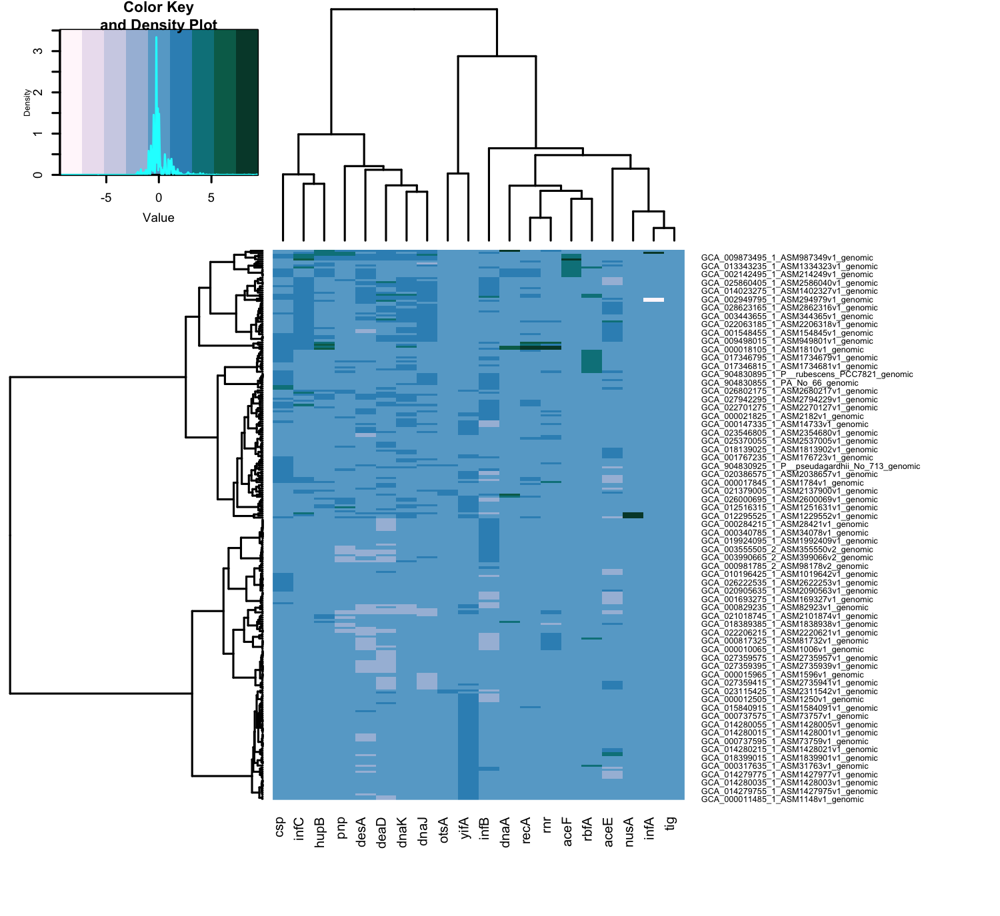

```{r setup, include=FALSE}
knitr::opts_chunk$set(echo = TRUE)
```

```{r message=FALSE}
#install.packages("viridisLite")
#install.packages("svglite")
#install.packages("factoextra")
#install.packages("cluster")
#install.packages("ggdendro")
#install.packages("grid")
```

## Load the Libraries

```{r message=FALSE}
library(tidyverse)
library(RColorBrewer)
library(paletteer)
library(janitor)
library(here)
library(skimr)
#library(viridis)
#library(shiny)
#library(shinydashboard)
library(devtools)
library(svglite)
#library(cluster)
#library(factoextra)
library(ggdendro)
library(grid)
library(gplots)
```

# load the matrix data from the new cyano WGS using NCBI datasets and GTDB
```{r message=FALSE}
df <- readr::read_csv("data/wgs_CTG_matrix.csv")
```

```{r}
glimpse(df)
```


```{r}
head(df)
```

```{r}
df_row <- df %>% 
  remove_rownames %>%      # making first column into the row names. When converted into matrix names will be there already
  column_to_rownames(var="genome_or_bin")
df_row
```


```{r}
names(df_row)
```


```{r}
df_scaled <- df_row 
df_scaled <- scale(df_scaled)
df_scaled[is.na(df_scaled)] <- 0

# filament_cyanos_scaled
```

```{r}
df_matrix <- data.matrix(df_scaled[,2:ncol(df_scaled)])
df_matrix[is.na(df_matrix)] <- 0
df_matrix[,colnames(df_matrix)!="genome_or_bin"]
```

```{r}
png(file="wgs_heatmap.png",
    width = 5*300,        # 5 x 300 pixels
    height = 5*275,
    res = 300,            # 300 pixels per inch
    pointsize = 6)        # smaller font size)

row_distance = dist(df_matrix, method = "manhattan") 
row_cluster = hclust(row_distance, method = "ward.D")
col_distance = dist(t(df_matrix), method = "manhattan")
col_cluster = hclust(col_distance, method = "ward.D")


Colors=brewer.pal(11,"PuBuGn")  
#Colors=c("white","blue", "green")
#Colors=colorRampPalette(Colors)(100)
heatmap.2(df_matrix, 
          margins = c(7, 19), # words aren't cut off in png output
          trace = "none", # trace is the cyan histogram, get rid of it
          density.info="density", # density plot, not histogram
          col=Colors,
          Rowv = as.dendrogram(row_cluster), # changing the cluster and distance methods from the default
          Colv = as.dendrogram(col_cluster)) 
dev.off()
```
```{r echo = FALSE}

```
